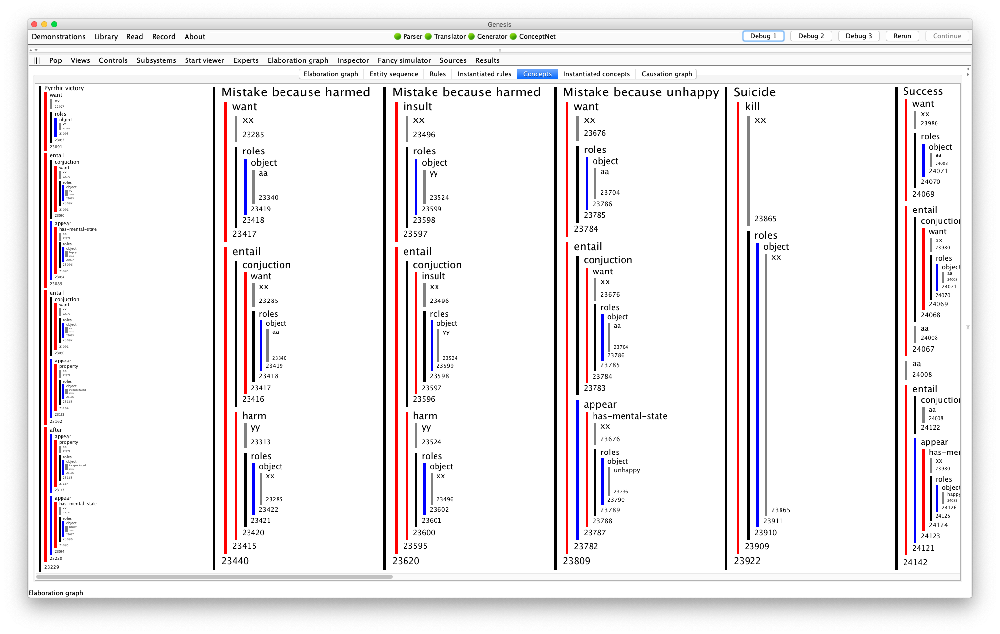
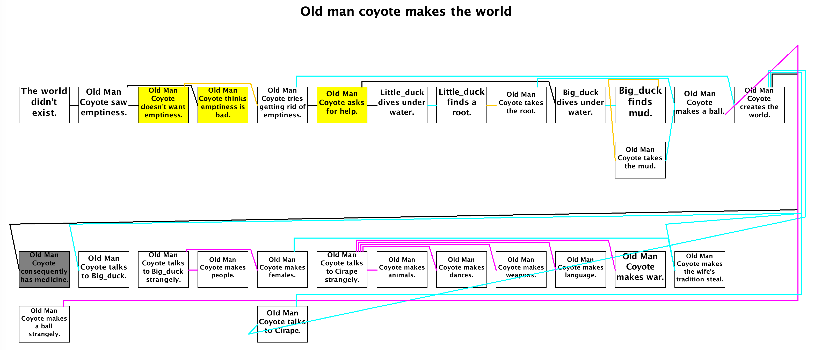

# Concept patterns

Concept patterns usually include specifications for searches expressed as `leads to` expressions:

```
Start experiment.
xx, yy, and zz are persons.
Macbeth, Macduff, and Duncan are persons.

Start description of "Revenge".
xx's harming yy leads to yy's harming xx.
The end.

if xx murders yy, then xx harms yy.
if xx harms yy and zz is loyal to yy, then xx harms zz.
if xx harms yy, then xx angers yy.
if xx angers yy, then yy may kill xx.
if xx kills yy, then yy becomes dead.
if xx kills yy, then xx harms yy.

// without this censor rule, there will be one more story element
if xx becomes dead, then xx cannot be angered.

Start story titled "Macbeth".
Macbeth murders Duncan.
Macduff is loyal to Duncan.
Macduff kills Macbeth.
The end.
```

Note that a concept pattern looks like a story, except that the opening idiom, `Start description of ...` .is different from `Start story titled ...`.

Theleads topart of the concept pattern says that the first event must be causally connected to the second event but there may be any number of causal links in between.

For example, there are three causal links connecting `Macbeth harms Macduff` to `Macduff harms Macbeth`, as shown in figure below.


You see that the `Analysis` line in the user interface indicates that Genesis has identified the `Revenge` pattern as a concept, even though the word revenge did not appear in the story.

On the Genesis Interface > Elaboration graph > Concepts, you see that concept patterns are translated into sequences:




## Multiple leads-to expressions

Concept patterns may have multiple `leads-to` expressions:

```
Start description of "Pyrrhic victory".
xx is an entity.
zz is an entity.
ll is an action.
xx’s wanting ll leads to xx’s becoming happy.
xx’s wanting ll leads to zz’s harming xx.
The end.
```

## Ordinary relations and events

This particular example also illustrates the incorporation of an unspecified action,`ll`.

Concept patterns may also have ordinary relations and events that are not involved in `leads-to` relations. In the following, `yy is an enemy of zz` and `I am a friend of yy` are relations and `yy helps xx` is an event:

```
Start description of "Sell out".
xx is an entity.
yy is a entity.
zz is a entity.
yy is an enemy of zz.
yy helps xx.
I am a friend of yy.
zz’s helping xx leads to xx’s angering yy.
The end.
```

## "Consequently" inserts elements

When you want a concept pattern to insert an element into the story, use "Consequently":

```
Start description of "Revenge".
xx's harming yy leads to yy's harming xx.
Consequently, yy is vicious.
The end.
```


Another example is handling Crow folktales, as `xx has strong medicine` is instantiated from pattern variables previously bound and inserted back into the story if the following concept is discovered.

```
Start description of "Violated belief - Medicine Man".
xx is a person.
yy is a thing.
xx transforms yy.
Consequently, xx has strong medicine.
The end.
```




## "Notably" triggers popup

When you want a concept pattern to trigger a popup:

```
Start description of "Revenge".
xx's harming yy leads to yy's harming xx.
Notably, yy is vicious.
The end.
```


You may have both a notably element and a consequenlty element in the same concept pattern.


## "Not same as" statements

Finally, you can insist that two variables have different bindings using a `must not equal `expression.

For example, you can insist that nothing can be involved in revenge against itself:

Without the `xx must not equal yy`, suicide could be an act of revenge because, convolutedly, Lady Macbeth’s suicide harms herself, which harms Macbeth, a relative, which harms Lady Macbeth, a relative, so harm leads to harm.


---

This version is edited by Zhutian Yang, on 6 August 2019

An older version of [How to speak Genesese](https://groups.csail.mit.edu/genesis/Documentation/Genesese.pdf) is authored by Patrick H. Winston, on June 8, 2018
