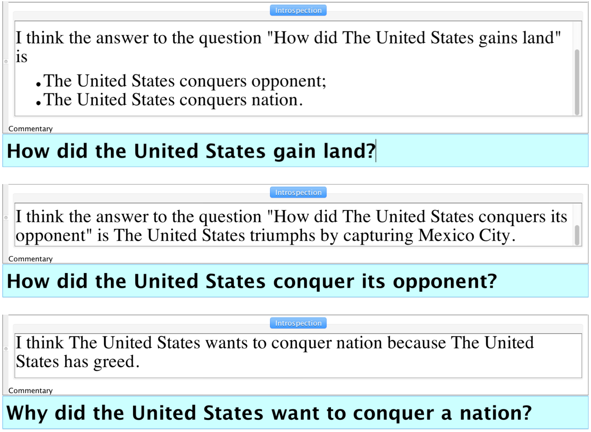
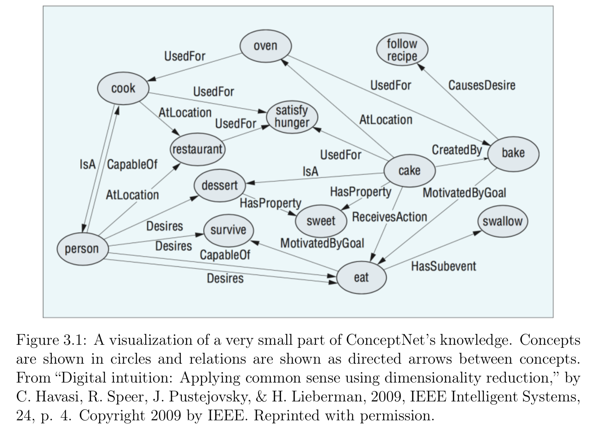
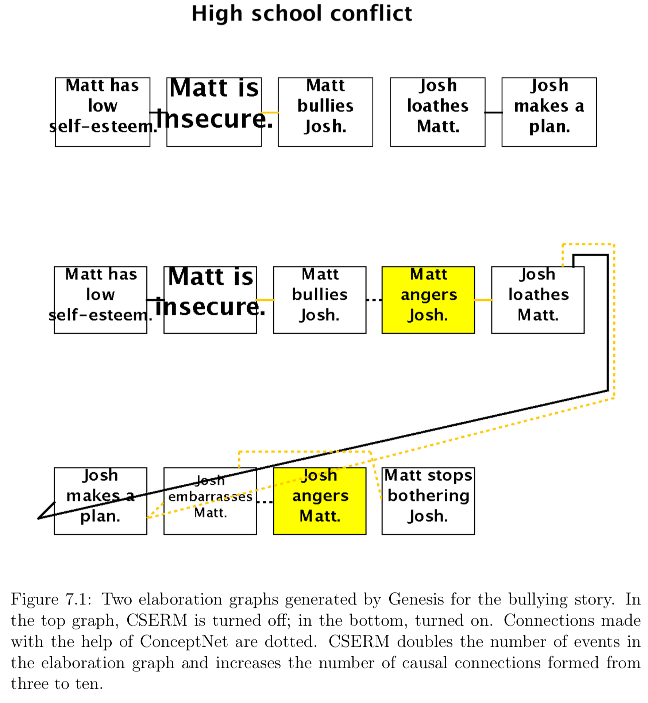
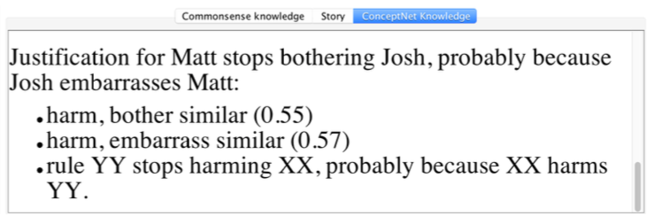
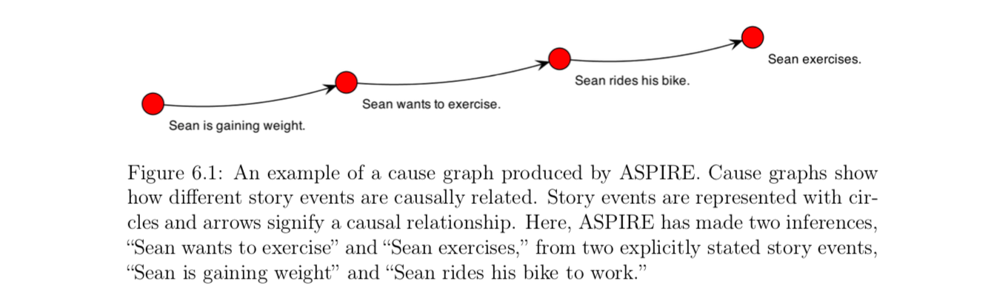
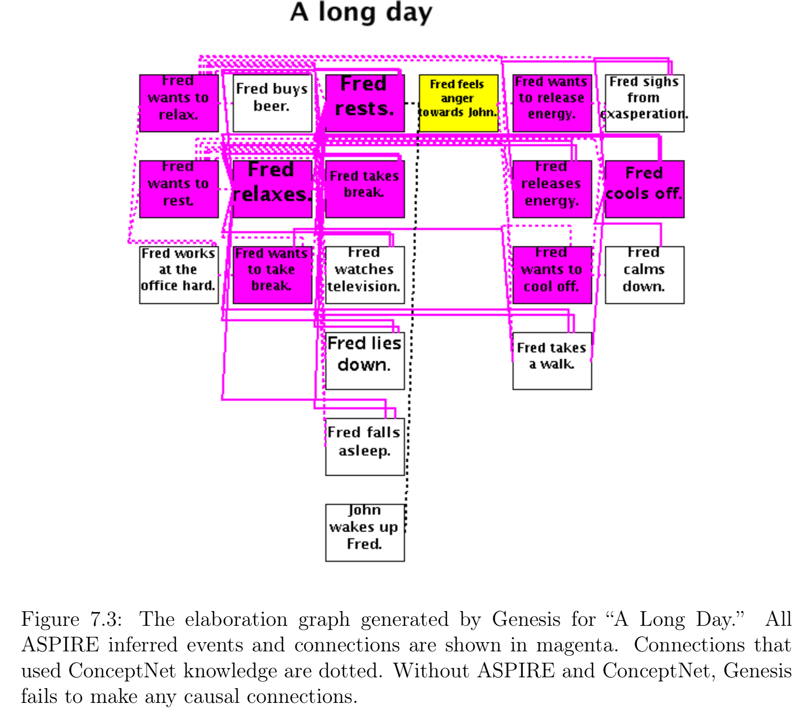
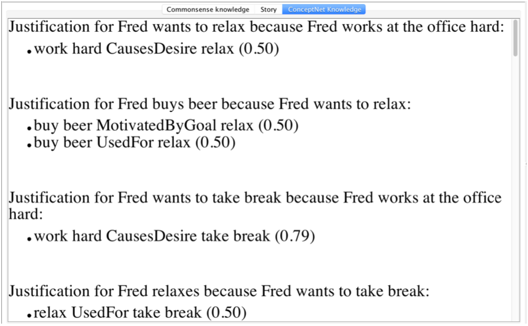
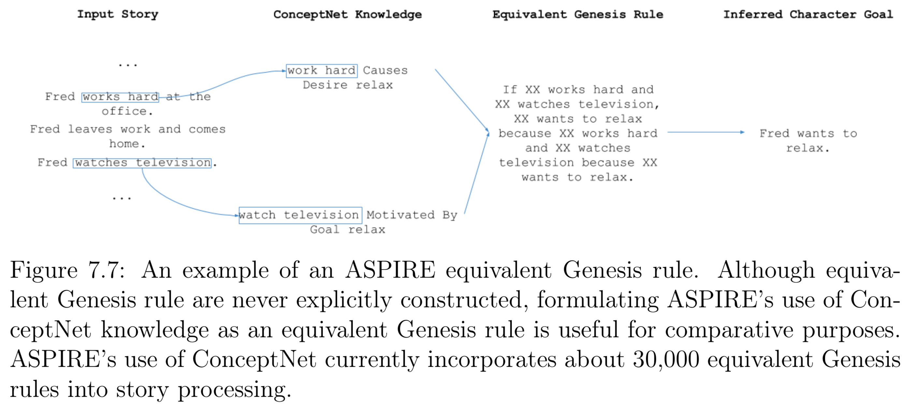

# ConceptNet Used in Genesis

Ideas and demos from Bryan Michael Williams 2017 MEng thesis [A Commonsense Approach to Story Understanding](http://groups.csail.mit.edu/genesis/papers/2017%20Bryan%20Williams.pdf)


## Commonsense reasoning

Given a story as the following

```
The United States is a country. Mexico is a country. The year is 1846. Manifest Destiny is popular in the United States. The United States has ambition, has greed, and wants to gain land. Mexico and the United States disagree over borders. The United States move into the disputed territory. Mexican forces attack the United States. The United States declares war on Mexico. Winfield Scott leads the United States army. The United States battles Mexico. The United States triumphs by capturing Mexico City. The United States defeats Mexico and wins the war. The Treaty of Guadalupe Hidalgo officially ends the war.
```
... Genesis can answer questions such as:



Note that Genesis answers the first question with two story elements which were never explicitly stated, but which were inferred from common sense.

The second and third questions ask Genesis about these inferences, and it backs them up with explicit story elements.


## ConceptNet

ConceptNet 4 contains about 22,000 English concepts connected in approximately 225,000 assertions and uses 27 relations. Some common relations are “Is A,” “Used For,” “Causes,” “Desires,” “At Location,” and “Has Property."



If multiple users submitted the same assertion, the score for that assertion increased (or decreased, if the assertion is negative) to represent the increased confidence. Users could also rate previously submitted assertions, and these ratings influenced the scores of the assertions (Havasi et al., 2009).

AnalogySpace was created by Havasi et al. to address the space sparsity problem by generating knowledge  based on existing knowledge. ConceptNet can be thought of as a three-dimensional matrix of assertions where the dimensions are the left concept, the relation, and the right concept. The value in each matrix entry is the score of that assertion, or zero if that assertion is not present. This matrix is very sparse, but singular value decomposition (SVM) can be used to fill in many of its gaps.

SVM creates a transfer of information between similar concepts. For example, if the original knowledge base knows that apples and oranges have many of the same properties, but only knows that apples are used for juice, AnalogySpace has evidence that oranges are also used for juice

Genesis get ConceptNet assertions through queries:


## Genesis Uses Similar Assertions

If the event were “Matt eats an apple,” Genesis would also be able to infer that Matt is full because it consults WordNet when processing every entity in the story, and WordNet tells it that an apple is a type of food (along with it being an instance of produce, an editable fruit, a solid, etc.)

Genesis also uses Similarity in ConceptNet 4 to enable more rules to fire and Relatedness in ConceptNet 5.

CSERM is an extension of Genesis’s normal rule matching which uses WordNet. The job of CSERM is to determine if two Genesis entities, one of which is a rule, are similar enough that the rule should fire.

ConceptNet can tell Genesis that “attack” is similar to “harm” so that if there are rules that discuss harming, story events that contain attacking can still trigger these rules. ConceptNet knows that words such as "deceive," "threaten," "rob," "anger," "attack," "torture," "dishonor," "murder," and "embarrass" are all similar to "harm," and a thesaurus does not.

Connections made with the help of ConceptNet are dotted:



The justification for the similarity match is shown in `source`, explains why Genesis believes Josh embarrassing Matt causes Matt to stop bothering Josh:



CSERM has two important limitations: it can introduce a significant slowdown on stories with large rulesets, and it relies on a cutoff value to determine how high a similarity score must be for two concepts to be treated as similar.


## Genesis Understands Desires, Goals, and Actions

Enabling Genesis to better understand goals, their causes, and actions taken towards completing them improves Genesis's comprehension of goal-oriented stories.

With ASPIRE and ConceptNet, Genesis can much more completely identify the causal relationships between the story’s events with far less user effort. The relations "Causes Desire," "Motivated By Goal," "Used For," and "Has Subevent" are all particularly relevant to the goal domain. Of the approximately 225,000 assertions ConceptNet 4 contains, around 20,000 of these are relevant to the goal information ASPIRE requests.

ASPIRE maintains a list of candidate character goals as Genesis sequentially reads the story, adding to the list when it detects that a story event might cause a character in the story to have a goal or contribute to any existing ones.

To query ConceptNet, ASPIRE forms the feature “gain weight Causes Desire ____” and uses ConceptNetClient to get a list of scored ConceptNet assertions that complete this feature. In this case, ConceptNet knows that gaining weight causes the desire of exercising, so the returned list contains the assertion “gain weight Causes Desire exercise” among other relevant assertions. Therefore, ASPIRE adds the candidate character goal “Sean wants to exercise” to its list and continues reading the story. the candidate character goal “Sean wants to exercise” is just an idea Genesis is holding in the back of its mind until it sees evidence supporting it.

When processing the event “Sean rides his bike to work,” ASPIRE extracts the concept “ride bike” from the event, “exercise” from the candidate character goal, and uses ConceptNetClient to obtain the scores for the assertions “ride bike Motivated By Goal exercise,” “ride bike Used For exercise,” and “exercise Has Subevent ride bike.” If ConceptNet confirms any of these assertions, ASPIRE concludes that the event contributes to the candidate character goal;

If ASPIRE concludes that a story event contributes to a candidate character goal, Genesis forms causal connections and adds new inferred events to the story based on ASPIRE’s analysis:



Another goal-oriented story:



The justifications:



The equivalent Genesis Rules:



Without ASPIRE or any ConceptNet knowledge, Genesis would form zero causal connections and therefore couldn’t answer any “Why” or “How” questions about the story.

The cutoff value is 0.3 for ASPIRE, a value which I have experimentally found to produce satisfactory results

## Demo:


## Common sense knowledge

Commonsense reasoning is different from logical reasoning. As logical reasoning would combine the true assertions "volleyball Is A sport" and "sport At Location field," which is rarely true because volleyball is usually played indoors or on a beach.

Commonsense reasoning is also not statistical. The score for "sport At Location field" is not determined by dividing the number of sports, as such an approach ignores context dependency. Instead, ConceptNet embraces the very nature of common sense--assertions can be ambiguous, contradictory, or context-dependent.


## Limitations

ConceptNet only describes binary relationships, while Genesis rules can contain and unbounded number of consequents and antecedents.
