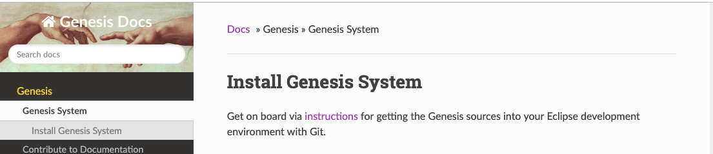

# Contribute to Documentation

## Step 1: Clone Project

Please send me your GitHub email address so that I can add you to the Genesis Docs project as a collaborator.

After I have replied you, open terminal and go to your work directory (e.g., ~/Documents). Then clone the project and go to the project folder:

```
$ git clone git@github.com:ztyang-mit/genesis-doc.git
```

Here is the layout of the project:

    mkdocs.yml      # The configuration file, e.g., for organizing the pages
    docs/
        index.md    # The documentation homepage
        ...         # Other markdown pages
        imgs/
            ...     # Images
        css/
            extra.css   # style file to customize based on site/theme.css and site/theme_extra.css
    site/           # You can ignore thing here, MkDocs generNates them when you deploy the page


## Step 2: Install MkDocs

[MkDocs](https://www.mkdocs.org/#mkdocs) is a fast, simple and downright gorgeous static site generator that's geared towards building project documentation. Documentation source files are written in Markdown, and configured with a single YAML configuration file.

You can install MkDocs using pip or other package manager.

### Install with pip

If you use the Python package manager, [pip](https://pip.readthedocs.io/en/stable/installing/), then you can:

```
$ pip install --upgrade pip
$ pip install mkdocs
```

To check that it is installed:

```
$ mkdocs --version
mkdocs, version 1.0.4
```

### Install with a Package Manager

If you prefer useing another package manager (such as `apt-get`, `dnf`, `homebrew`, `yum`, `chocolatey`, etc.) to install packages on your system, then you may install `MkDocs` with your package manager.


## Step 3: Start MkDocs Server

MkDocs comes with a built-in dev-server that lets you preview your documentation as you work on it. Make sure you're in the same directory as the `mkdocs.yml` configuration file, and then start the server by running the `mkdocs serve` command:

```
$ mkdocs serve
INFO    -  Building documentation...
INFO    -  Cleaning site directory
[I 160402 15:50:43 server:271] Serving on http://127.0.0.1:8000
[I 160402 15:50:43 handlers:58] Start watching changes ...
```
The command will open up [http://127.0.0.1:8000/](http://127.0.0.1:8000/) in your browser, and you'll see the home page being displayed:



## Step 4: Edit Pages

Before you make changes to the project, make sure to `git pull` the latest changes made by other to avoid conflict.

When you save changes to the project, [http://127.0.0.1:8000/](http://127.0.0.1:8000/) will automatically update.

### Add a page

If you want to add a page to the wiki, reate a new markdown file in the `docs/` directory.

Then, add its name and markdown file name to `mkdocs.yml`, where you will see:

```
nav:
    - Genesis:
      - Genesis System: index.md
      - Contribute to Documentation: mkdocs.md
    - Representation:
      - Inner Language - Innerese: innerese.md
      - ...
    - Fundamentals:
      - Inference by Rules: inference.md
      - ...
    -
```

The current hierarchy and order is designed so that a new student can use the documentation as a tutorial. Please feel free to make changes. Major reorganization is possible upon discussion among the collaborators:

```
Zhutian Yang: ztyang@mit.edu
Michael Fleder: mfleder@mit.edu
```

### Write a page

Our wiki pages are written in [Markdown](https://en.wikipedia.org/wiki/Markdown#Example), a lightweight markup language with plain text formatting syntax. The following cheatsheet designed by Theme Spectre showed the most frequently used syntax:


To make it even easier to write in Markdown, you can add Markdown plugin to your editor. For example, I use `markdown-editor` in Atom to enjoy the following features:

* Toggle text styles using shortcut such as `Ctrl+B`
* Continue lists and table rows when press `enter`
* Correct ordered list numbers


## Step 5: Deploy After Editting

### Before you deploy for the first time


When you deploy, the html pages will be generated into the `site/` directory. One thing annoying is that such a footer will also be automatically generated onto every page:


The solution is to change the `MkDocs` python package footer file. To find out the location of the package, check the version of `MkDocs` in commandline:

```
$ mkdocs --version
mkdocs, version 1.0.4 from /miniconda3/lib/python3.7/site-packages/mkdocs (Python 3.7)
```

In `mkdocs/themes/readthedocs/footer.html`, change the following lines:

```
  Built with <a href="http://www.mkdocs.org">MkDocs</a> using a <a href="https://github.com/snide/sphinx_rtd_theme">theme</a> provided by <a href="https://readthedocs.org">Read the Docs</a>.
```
into our own footer:

```
Maintained by the Gensis Group, Computer Science and Artificial Intelligence Lab, MIT. <br>
Any questions? Contact Yang at <a href="mailto:ztyang@mit.edu">ztyang@mit.edu</a>
or Dylan at <a href="mailto:dxh@mit.edu">dxh@mit.edu</a>
```

### Routine deploy with one command

Currently, the wiki page is hosted on GitHub. We will later shift over to private domains.

After you have made the changes, simply do this in the same directory as the `mkdocs.yml` file:

```
mkdocs gh-deploy --clean
```

The page will be updated on [https://ztyang-mit.github.io/genesis-doc/](https://ztyang-mit.github.io/genesis-doc/). A short url that directs to the page is [bit.ly/genesis-docs](bit.ly/genesis-docs).

Note that you don't have to `git push`. The deploy command does it for you.

---

## Style Guide

To make the pages easier to read, Yang tries to follow a few style rules:

* Write short paragraphs
* Include examples for each topic
* Include screenshots for each example
* Include a summary for each page
* Use `inline code` style for objects in java code, such as
    * class names, e.g., the `Translator` class
    * function names, e.g., `Mark.say()`
    * frame names, e.g., `John` and `with`
    * input sentence, e.g., `John killed Mary`

---

## Summary

In this article, you have learned how to install the MkDocs package, write documentation pages, and deloy the site.

* Every time you work on the project, you need to use two commands at the project directory.

```
$ mkdocs serve              # before editting, start the MkDocs server
$ mkdocs gh-deploy --clean  # after editting, deploy the site
```

* During editting, you add and organize pages at the configuration page, `mkdocs.yml`.
* You write pages using Markdown, which makes it easy to style text, add links, codes, and images.
* You may follow or revise the _Style Guide_ to make the documentation easier to read.
