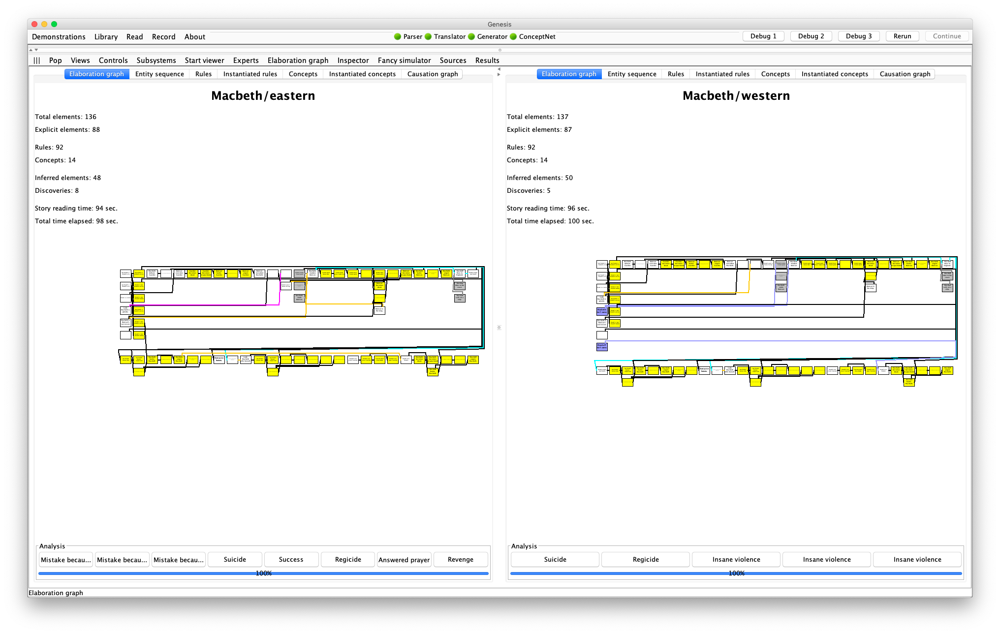
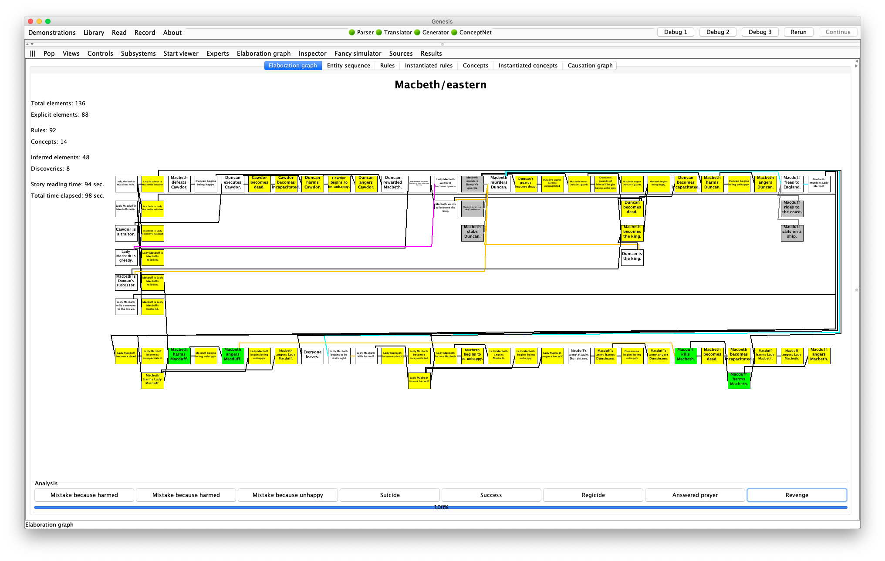
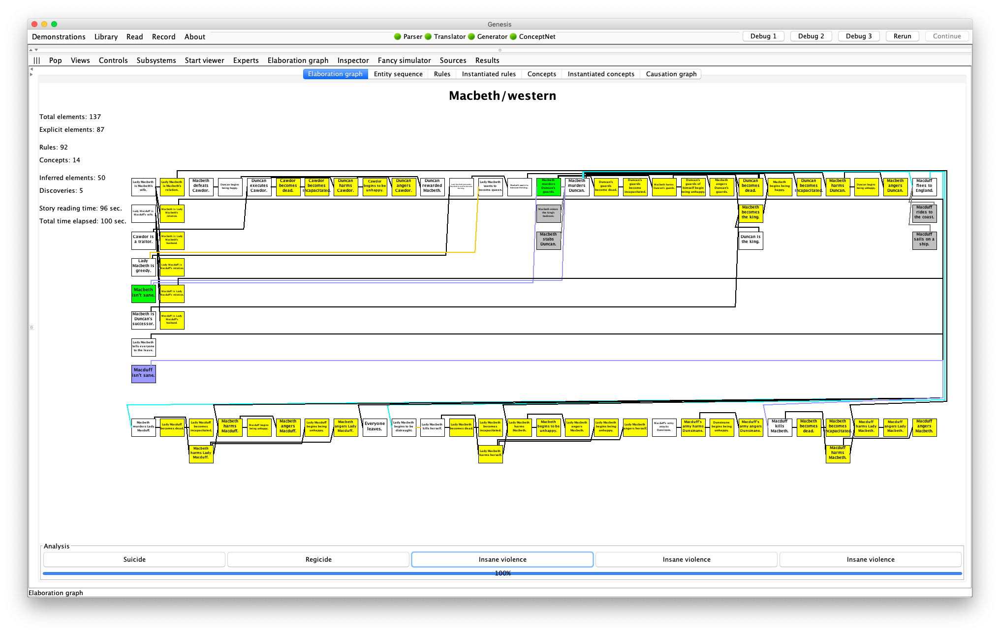
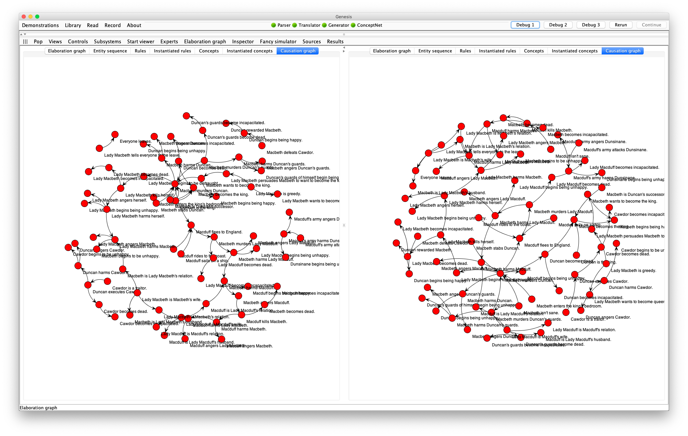

# Demo: Culture Difference in Interpreting Macbeth

In this demo, Genesis uses two sets of common sense rules and concept patterns to read a short, simple version of Macbeth—about 100 lines—and constructs two elaboration graphs.



The elaboration graph on the left reflects the Asian bias toward viewing violence situationally, that is, as a consequence of situations in which the actors are immersed.



The elaboration graph on the right reflects the Western bias toward viewing violence dispositionally, that is, as a consequence of actor characteristics.



The causal graphs constructed also have different shapes:



The demonstration also illustrates how Genesis answers why questions (on the common sense and the conceptual level) and how questions (by reporting on the steps involved).

Click or right click to zoom in or out on the elaboration graph. Press and drag to move the elaboration graph.

Press Revenge button at the bottom of the left elaboration graph and examine the elements involved in the Inspector pane. You see that Macduff kills Macbeth is situational.


Press the Insane violence buttons on the right until you find the concept pattern in which Macduff kills Macbeth. On this side, you see that the killing is dispositional.

### The story files

Here is `corpora/stories/Shakespeare/Macbeth2.txt`

```
Start experiment.               # clears away text boxes and memory from previous experiment
Set all switches to defaults.   # TODO: What are the default switches

Set concept switch to false.
Set show text box switch to false.
Set show all story elements switch to false.
Set right panel to mental models.
Set bottom panel to elaboration graph.
Insert file Macbeth2 common.

/*
Insert question into text box: Why did Macduff kill Macbeth?
Insert question into text box: How did Macbeth murder Duncan?
*/
```

Here is `corpora/stories/Shakespeare/Macbeth2 common.txt`

```
Both perspectives.

Show both perspectives.
Insert file Common commonsense knowledge.
Insert file General reflective knowledge.

First perspective.
"Eastern" is a kind of personality trait.
"Machiavellian" is a kind of personality trait.

Second perspective.
"Western" is a kind of personality trait.

Both perspectives.

First perspective.
Start story titled "Macbeth/Eastern".
I am eastern.
I am machiavellian.

Second perspective.
Start story titled "Macbeth/Western".
I am western.

Both Perspectives.
Insert file Macbeth plot.
```

Here is the Machiavellian mental model:

```
WW, XX, YY, and ZZ are persons.

Patrick is a person.
If XX is an enemy of ZZ and YY is an enemy of ZZ, then XX may be a friend of YY.
If XX is an enemy of ZZ and YY is an enemy of ZZ, then YY may be a friend of XX.

Start story titled "Machiavellian person's characteristics".
Patrick protects himself.
The end.
```

Here is the eastern mental model:
```
WW, XX, YY, and ZZ are persons.

YY may kill WW because YY wants to kill WW.

// TODO: What is this!?
If value of variable test-expert-request is false: XX may kill YY because YY angers XX.
If value of variable test-expert-request is false: YY may murder WW because YY wants to become king and because WW is the king and because YY is WW's successor.

Start description of "Revenge".
xx is an entity.
yy is a entity.
xx's harming yy leads to yy's harming xx.
The end.

Start story titled "Eastern person's characteristics".
The end.
```

Here is the western mental model:

```
XX and YY are entities.

If XX is American and XX becomes angry, then XX becomes violent.
If XX becomes violent, then XX may kill YY.
If XX kills YY then XX must not be sane.

Start description of "Insane violence".
XX's not being sane leads to XX 's killing YY.
The end.

Start story titled "Western person's characteristics".
The end.
```

<mark> Why can't there be three or more perspectives? How about I put text and configurations in different slots of json so that I can put in descriptions of scenes and characters. I can put all contents in one file so it's easier to control.


See [Local knowledge base](genesis-knowledge.md) for Genesis's local knowledge base.

Here is `corpora/stories/Shakespeare/Macbeth plot.txt`

```
Insert file Macbeth preface.

Scotland and England are countries.
Dunsinane is a castle and Birnam Wood is a forest.
Macbeth, Macduff, Malcolm, Donalbain, Lady Macbeth, Lady Macduff, Cawdor, and Duncan are persons.
Lady Macbeth is Macbeth's wife.
Lady Macbeth is evil and greedy.
Duncan is the king, and Macbeth is Duncan's successor.
Duncan is an enemy of Cawdor.
Macbeth is brave.
...
The end.
```

Here is `corpora/stories/Shakespeare/Macbeth preface.txt`

```
Note that Cawdor is a name.
Note that Duncan is a name.
Note that Lady Macbeth is a feminine name.
Note that Lady Macduff is a feminine name.
Note that Macduff is a name.
Note that Macbeth is a name.
Note that Malcolm is a name.
Note that Donalbain is a name.
Note that Dunsinane is a name.
Note that Birnam Wood is a name.
```
