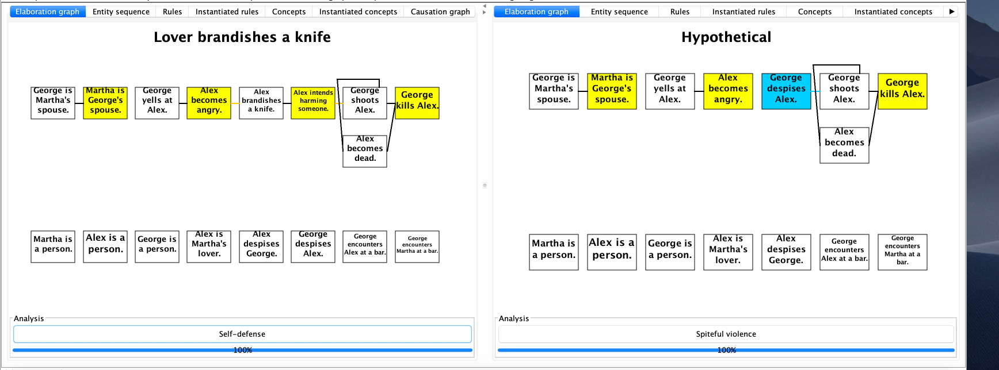
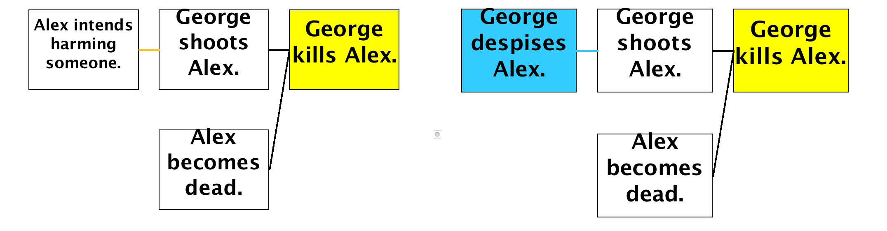
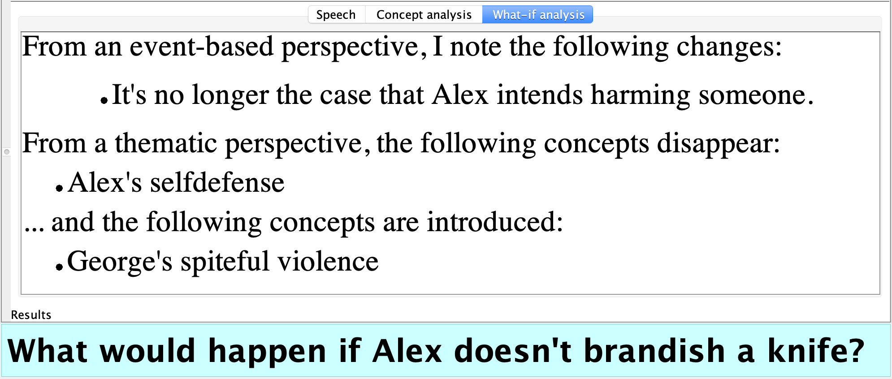

# What-If Hypothetical reasoner

## Demo
The program will read a short courtroom-style story about a husband who uses a gun to defend himself from his wife's knife-wielding lover. Based on the events in the story, the program reasons that the story is about self-defense.

When asked how the analysis would differ if the lover did not brandish a knife, the program is able to reason about its own thinking; it concludes that in the second case, the husband's response is unjustified.

The elaboration graphs before and after the insertion of element:



Main difference in reasoning:



The two rules used differently in the two cases:

```
If xx brandishes a knife, then xx intends to harm someone.
xx may shoot yy because yy intends to harm someone.

xx can shoot yy because xx despises yy.
```

In original story, the event of "Alex brandishes a knife" triggers a deduction rule, which is prevents the trigger of explanation rule "xx can shoot yy because xx despises yy":

```
Alex and George despise each other.
George encounters Alex and Martha at a bar.
George yells at Alex.
Alex brandishes a knife.
Alex becomes dead because George shoots Alex.
```

The analysis:



Any event can be removed from the story by asking "What would happen if [an event didn't happen]."
