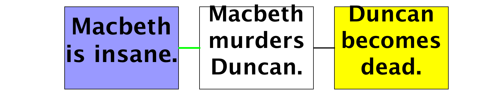
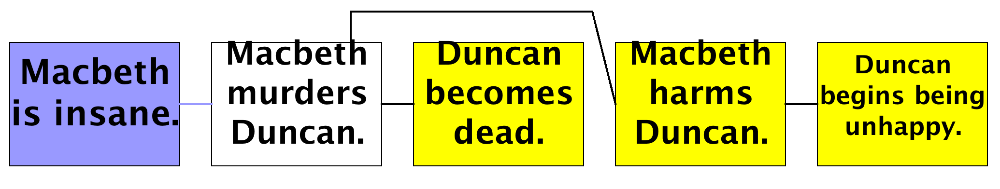
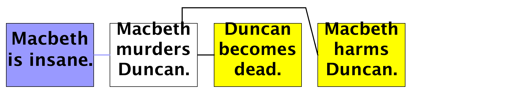
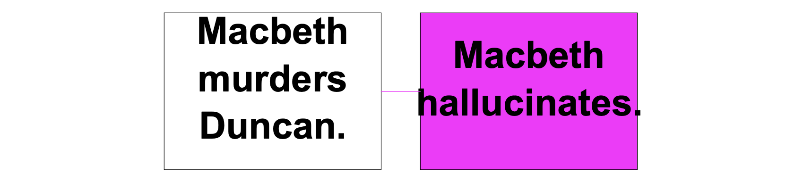
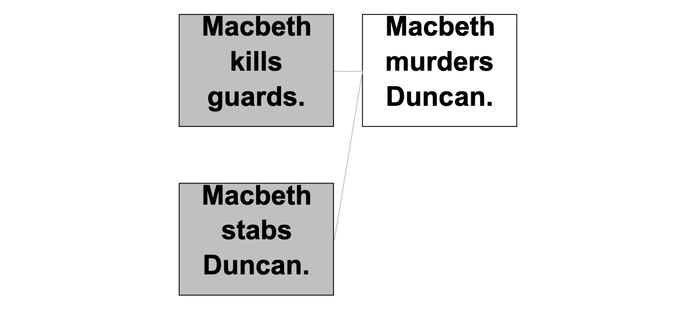
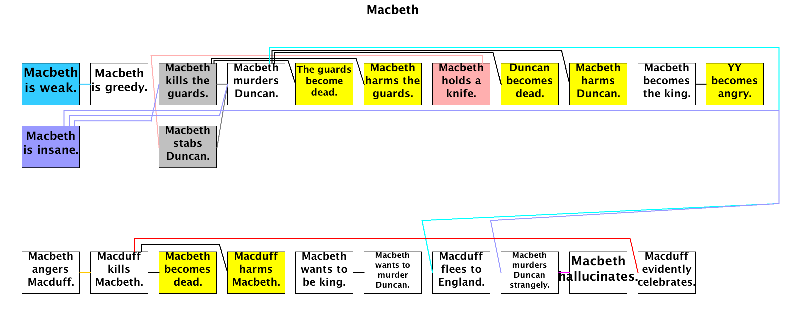
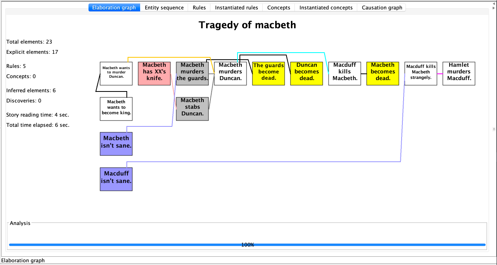

# Inference by Rules

## ... Prediction rules

The story becomes more interesting when you add common sense prediction rules. Prediction rules establish connections between one or more antecedents and one consequent.

Here, Genesis is told that if a person kills someone, that other person becomes dead:

```
Start experiment.

xx, yy, and zz are persons.

// A prediction rule:
If xx kills yy then yy becomes dead.

Start story titled "Tragedy of Macbeth".
Macbeth, Macduff, and Duncan are persons.
Macduff kills Macbeth.
The end.
```

Now in the elaboration graph, in yellow, you see the consequent event, and that consequent is connected to its antecedent by a line, as shown in figure below:


Common sense rules are generally of the form `If ... then ....`, but you can also use an alternate form with the word `because`:

`yy becomes dead because xx kills yy.`


## ... Explanation rules

We humans always seek explanations, so Genesis uses explanation rules to join a action to a previous action whenever an event occurs that would otherwise lack an explanation.

Consider this version:
```
Start experiment.
xx, yy, and zz are persons.

// A prediction rule:
If xx kills yy then yy becomes dead.

// An explanation rule; note use of "may":
If xx angers yy, then yy may kill xx.

Start story titled "Tragedy of Macbeth".
Macbeth, Macduff, and Duncan are persons.
Macbeth angers Macduff.
Macduff kills Macbeth.
The end.
```

The explanation rule indicates that if there is no other explanation for yy killing xx, and there is an assertion already that xx angers yy, then there is an assumed causal connection.

The reason for explanation rules, marked with `may`, is that the antecedent, in this example, `xx angers yy`, does not always lead to the consequent, `yy kills xx`. The result appears in the elaboration graph shown in figure below:


Note that explanation-rule connections are shown in orange and dotted, rather than solid black. Note also that explanation rules can be, like inference rules, expressed with `because`:

`xx may murder yy because xx wants to murder yy.`


## ... Presumption rules

Genesis uses presumption rules to join an action to an imagined cause whenever there is no other explanation for an action and no explanation rule provides one. Explanation rules require their antecedents to be in a story; presumption rules put antecedents into the story, as in the following example:

```
Start experiment.
xx, yy, and zz are persons.

// A presumption rule; note use of "can be"
If xx is foolish, xx can be greedy.

Start story titled "Tragedy of Macbeth".
Macbeth, Macduff, and Duncan are persons.
Macbeth is greedy.
The end.
```

The result appears in the elaboration graph shown in figure below:


## ... Abduction rules

Sometimes we assume a cause when a consequence is stated, thus doing abductive inference. Thus, abduction is something like presumption, but happens no matter whether there is an alternative explanation or not. For example, Genesis can conclude that if someone murders someone else, that person must be insane:

```
Start experiment.
xx, yy, and zz are persons.

// A prediction rule:
If xx kills yy then yy becomes dead.

// An abduction rule; note use of "must be"
If xx kills yy, xx must be insane.

Start story titled "Tragedy of Macbeth".
Macbeth, Macduff, and Duncan are persons.
Macbeth murders Duncan.
The end.
```
The result is shown in the elaboration graph shown in figure below:




## ... Enablement rules

Sometimes we assume a required condition must hold because a certain type of action occurred. Genesis uses enablement rules to do so.

For example, Genesis can conclude that if someone stabs someone else, that person have a knife.

```
Start experiment.
xx, yy, and zz are persons.

// An enablement rule; note use of "enables"
Xx’s having a knife enables xx’s stabbing yy.

Start story titled "Tragedy of Macbeth".
Macbeth, Macduff, and Duncan are persons.
Macbeth stabs Duncan.
The end.
```

The result is shown in the elaboration graph shown in figure below:


## ... Post hoc ergo propter hoc

When two events are adjacent to each other in the story, we can indicate a causal connection using a post hoc ergo propter hoc rule, as in:

```
Start experiment.
xx, yy, and zz are persons.

// A post hoc ergo proper hoc rule; note use of semicolon
xx becomes king; yy becomes angry.

Start story titled "Tragedy of Macbeth".
Macbeth, Macduff, and Duncan are persons.
Macbeth becomes king.
Macduff becomes angry.
The end.
```
Because `Macduff ’s becoming angry` directly follows `Macbeth becomes king`, the rule yields the result shown in figure below:


Note that if there are any sentences in between, the rule does not apply.


## ... Censor rules

A censor rule prevents inference and explanation rules from making ridiculous conclusions. For example, if you murder someone, you harm them. If you harm someone, that person becomes unhappy. But if you murder someone, that person cannot come to have some emotional state because that person is dead, even though an inference rule thinks that person should become unhappy.

The solution is to introduce a censor rule:

`If YY becomes dead, then YY cannot become unhappy.`

Such a rule, indicated by `cannot`, prevents any other rule from asserting that someone is unhappy after that person becomes dead.

```
Start experiment.
xx, yy, and zz are persons.

// A prediction rule:
If xx kills yy then yy becomes dead.

// An explanation rule; note use of "may":
If xx angers yy, then yy may kill xx.

// A presumption rule; note use of "can be"
If xx is foolish, xx can be greedy.

// An abduction rule; note use of "must be"
If xx kills yy, xx must be insane.

// An enablement rule; note use of "enables"
Xx’s having a knife enables xx’s stabbing yy.

// A post hoc ergo proper hoc rule; note use of semicolon
xx becomes king; yy becomes angry.

// A censor rule; note use of cannot
If xx becomes dead, then xx cannot become unhappy.

// Prediction rules that would otherwise make a person unhappy if killed.
If xx kills yy then xx harms yy.
If xx harms yy then yy becomes unhappy.

Start story titled "Tragedy of Macbeth".
Macbeth, Macduff, and Duncan are persons.
Macbeth murders Duncan.
The end.
```

Before adding the censor rule:



After adding the censor rule `If xx becomes dead, then xx cannot become unhappy`:




## Multiple antecedents/consequents

Inference rules, explanation rules, and censor rules all may have multiple antecedents, as in this inference rule:

```
Start experiment.
xx, yy, and zz are things.
If xx is a kind of yy and yy is a kind of zz, then xx is a kind of zz.

Start story titled "Tiger is animal".
Tiger is a kind of cat.
Cat is a kind of animal.
The end.
```

Inference rules may not have multiple consequents, however. You would need to express such a rule as multiple rules, one for each consequent.


## Explicit connections

Sometimes stories can contain explicit causal connections.


## ... Cause expressions

Explicit cause expressions connect antecedents to consequents. For example:

```
Start experiment.
Start story titled "Tragedy of Macbeth".
Macbeth, Macduff, and Duncan are persons.
Macbeth wants to murder Duncan because Macbeth wants to become king.
The end.
```

The result appears in the elaboration graph, which now has an explicit connection, as shown in figure below:


## ... Leads to expressions

You can also use `leads to` expressions in stories, meaning there is a causal connection, but the details are not given, as in:

```
Start experiment.
Start story titled "Tragedy of Macbeth".
Macbeth, Macduff, and Duncan are persons.
Macbeth’s murdering Duncan leads to Macduff’s fleeing to England.
The end.
```
The result appears in the elaboration graph, which now has an leads-to connection, as shown in figure below:


## ... Strangely leads to expressions

If you wish, you can add `Strangely`, indicating that the details are unknowable, which comes up, for example, in Victor Yarlott’s work on Crow folklore:

```
Start experiment.
Start story titled "Tragedy of Macbeth".
Macbeth, Macduff, and Duncan are persons.
Strangely, Macbeth’s murdering Duncan leads to Macbeth’s hallucinating.
The end.
```



## ... In order to expressions

Genesis treats means as a kind of causal connection because the means enables the action, as in the following:

```
Start experiment.
Start story titled "Tragedy of Macbeth".
Macbeth, Macduff, and Duncan are persons.
In order to murder Duncan, Macbeth kills the guards and stabs Duncan.
The end.
```
The result is shown in figure below:



## Probabilities

Ordinary entities as well as prediction rules and explanation rules can have probabilities attached.

The attachment is expressed as in the following examples (at this writing, if forms do not parse).

```
With probability of 0.2 xx becomes dead.
With probability of 0.7 xx becomes dead because yy stabs xx.
With probability of 0.2 xx may kill yy because yy angers xx.
```

What you do with these probabilities is for you to decide, as at the moment, nothing uses them.

Note that the entity getter, `getProbability`, fetches an entity’s probability if there is one, or `null` otherwise.


## Summary

Genesis uses 7 kinds of rules and 5 types of explicit expressions to connect story elements, existing or inferred.

Rules might connect existing story elements or introducing new elements, with optionally the probability of the rule firing:

Type  | Element in story  |  Example
--|---|--
Prediction rule  | 1st   |  If xx kills yy then yy becomes dead.
Censor rule  | 1st   |  If xx becomes dead, then xx `cannot` become unhappy.
Presumption rule  | 2nd   |  If xx is foolish, xx `can be` greedy.
Abduction rule  | 2nd   |  If xx kills yy, xx `must` be insane.
Enablement rule  | 2nd   |  xx’s having a knife enables xx’s stabbing yy.
Explanation rule  | both   |  If xx angers yy, then yy `may` kill xx.
Post hoc ergo proper hoc rule  | both   |  xx becomes king`;` yy becomes angry.

Explicit expressions connect existing story elements.

Type  | Example
--|---
Cause expression |  Macbeth wants to murder Duncan because Macbeth wants to become king.
Leads to expression |  Macbeth’s murdering Duncan leads to Macduff’s fleeing to England.
Strangely leads to expression |  Strangely, Macbeth’s murdering Duncan leads to Macbeth’s hallucinating.
In order to expressions  |  In order to murder Duncan, Macbeth kills the guards and stabs Duncan.

After color coding, the Elaboration Graph can be populated with existing story elements (white, cyan, magenta, gray boxes) and inferred elements (yellow, orange, purple, pink boxes):



[//]: # () 

---

This version is edited by Zhutian Yang, on 6 August 2019

An older version of [How to speak Genesese](https://groups.csail.mit.edu/genesis/Documentation/Genesese.pdf) is authored by Patrick H. Winston, on June 8, 2018
