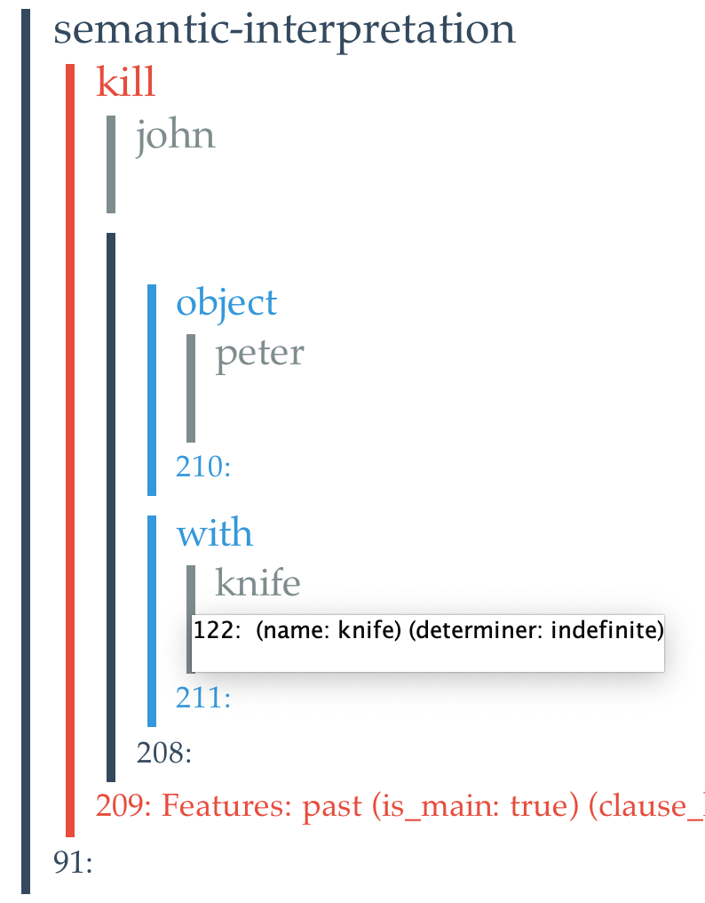
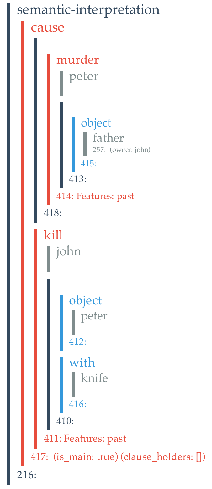

# Innerese

Innerese is the semantic structure used by Genesis System. It is based on what linguists call "thematic role frames," or role frames for short.

There are four classes of Innerese frames:

- The `Entity` class. A entity is usually a physical physical object. (So called so as not to conflict with Java’s `Object` class)
- The `Function` class. A function suggests the thematic role served by certain frame.
- The `Relation` class. A relation indicates how one frame is connected to another frame.
- The `Sequence` class. A sequence contains any number of frames.

The class heritage is:

```
       Entity
       __|__
      /     \
 function  sequence
     |
 relation
```

A `Entity` instance has no internal structure. `Function`, `Relation`, and `Sequence` consists of nested sequences of frames.


## The `Entity` class

The most fundamental class is the `Entity` class. Every instance of `Entity` has a unique name and bundle of threads. Because entities have threads, so do functions, relations, and sequences. Instances of `Entity` has no internal structure.

To create a new entity, identified as both a ball and a baseball, you execute the following:

```
Entity x = new Entity ("ball");
x.addType("baseball");
```

Then, you can inspect the result via print statements:
```
Mark.say(x)
Mark.say("----")
Mark.say(x.toXML);
```

The results:

```
>>> (ent baseball-0)
>>> ----
>>> <entity>
<name>baseball-0</name>
<bundle><thread>entity ball baseball</thread></bundle>
</entity>
```

The first thread of possibly many threads in the thread bundle is considered the primed thread. Whenever you add a type to a entity, using the `addType` method, that new type goes to the end of the primed thread.

The `isA` predicate tests for class membership by checking all the threads. Hence
`x.isA("ball")` returns `true`, but `x.isA("person")` returns `false`.

## The `Function` class

The Function class represents Jackendoff’s places and path elements. The Function class provides `getSubject` and `setSubject` accessors. The subject is to be filled with an instance of Entity or its subclass.

To construct a function that represents the top of a table:

```
Entity e = new Entity("table");
Function f = new Function("top", e);
Mark.say(f);
Mark.say(f.getSubject());
```

The results:
```
>>> (fun top (ent table-1))
>>> (ent table-1)
```

## The `Relation` class

The `Relation` class simply adds an object slot to the `Function` class, with `getObject` and `setObject` accessors.

```
Entity d = new Entity("door");
Entity w = new Entity("window");
Relation r = new Relation("between", d, w);
Mark.say(r);
Mark.say(r.getSubject());
Mark.say(r.getObject());
```

The results:
```
>>> (rel between (ent door-4) (ent window-5))
>>> (ent door-4)
>>> (ent window-5)
```

## The `Sequence` class

An Innerese representation of a sentence may consists of a sequence of relations. A relation may exists between an entity and a sequence of functions.

Sequences can appear when Genesis produces role frames from English.

For example, Given _John killed Peter with a knife_, Genesis produces a
sequence containing two roles, one for the object, Peter, and one for the instrument, the knife.

```
Sequence roles = new Sequence("roles");
roles.addElement(new Function("object", new Entity("Peter")));
roles.addElement(new Function("with", new Entity("knife")));
Relation k = new Relation("kill", new Entity("John"), roles);
Mark.say(roles);
Mark.say(k);
```

The results:
```
>>> (seq roles
        (fun object
            (ent Peter-8))
        (fun with
            (ent knife-10)))
>>> (rel kill
        (ent John-12)
        (seq roles
            (fun object
                (ent Peter-8))
            (fun with
                (ent knife-10))))
```

## Innerese is an implementation of Role frames.

Much of what Genesis reads ends up in what linguists call thematic role frames, role frames for short, which consist of an actor along with an act or property and optionally various entities that fill varous roles in the act.

Thus, in _John killed Peter with a knife_, `John` is the _actor_, `kill` is the _act_, and `Peter` is the _object_. The `knife` entity, marked by a `with` preposition, fills what linguists would call the _instrument_ role.

In Genesis, role frames are implemented thusly: the actor entity is the subject (`John`) of a relation, whose _type_ indicates the act or property involved (`kill`).

All the role fillers, such as the object and instrument roles, are collected into a sequence that becomes the object of the relation.

Each role mentioned in the sequence is embedded in a function indicating something about the role played. For example, the object role is embedded in an `object` function; the instrument role is embedded in the `with` function.

### Innerese can be visualized as nested "frames"

The printed linear form of entities, functions, relations and sequences is far from transparent. Accordingly, when such instances are presented in a GUI they appear in a form conceived by Keith Bonawitz.

Here is a Bonowitz rendering of the role frame for _John killed Peter with a knife_.

> 
<!--  -->

Note the color coding: entities in gray, functions in blue, relatioins in red, sequences in black.

Also note that when you hove over various parts of the diagram, you see the various threads Genesis associates with each entity.

Next, you see a more complicated example in which two role frames are embedded in a stucture that ties antecedents (here only one) to consequents, _John killed Peter with a knife because Peter murdered John's father_.

> 
<!--  -->

## Innerese can be constructed from English

You generally do not have to ever construct Innerese yourself. Genesis does it for you by translating from English using Genesis Translator:

```
String sentence = "John marries Mary because John loves money";
Translator translator = Translator.getTranslator();
Entity entity = translator.translate(sentence);
Mark.say(entity);
```

The results:
```
>>> (seq semantic-interpretation
        (rel cause
            (seq conjuction
                (rel love
                    (ent john-93)
                    (seq roles
                        (fun object
                            (ent money-103)))))
            (rel marry
                (ent john-93)
                (seq roles
                    (fun object
                        (ent mary-100))))))
```

## Innerese can be externalized into English

Genesis also features an English generator. The following thus produces the same English that is provided:

```
Generator generator = Generator.getGenerator();
Mark.say(generator.generate(translator.translate(sentence).getElements().get(0)));
```
The results:
```
John marries Mary because John loves money.
```

## Innerese can be constructed using constructors and JFactory

To construct an Innerese frame yourself based on the above definitions can be tedious and error prone. Fortunately there are convenience constructors that help. For example, The following shows how to create a role frame and how to add an additional role to an existing role frame:

```
Relation rf = Constructors.makeRoleFrame(John, "kill");
Mark.say(rf);
rf = Constructors.makeRoleFrame(John, "kill", Peter);
Mark.say(rf);
rf = Constructors.addRole(rf, "with", knife);
Mark.say(rf);
```
```
-->
>>> (rel kill
        (ent John-14)
        (seq roles))
>>> (rel kill
        (ent John-14)
        (seq roles
            (fun object (ent Peter-15))))
>>> (rel kill
        (ent John-14)
        (seq roles
            (fun object
                (ent Peter-15))
            (fun with
                (ent knife-17))))
```

The following shows how to create a role frame involving a path object:

```
Entity tree = new Entity("tree");

// Create a place relative to entity
Function place = JFactory.createPlace("top", tree);

// Create a path element using place
Function pathElement = JFactory.createPathElement("from", place);

// Create a path using path element
Sequence path = JFactory.createPath();
path.addElement(pathElement);

// reate a trajectory using Use path
Entity trajectory = JFactory.createTrajectory(bird, "fly", path);

// Create another path element
Function origin = JFactory.createPathElement("to", JFactory.createPlace("at", new Entity("rock")));

// Add it to the path
JFactory.addPathElement(path, origin);

// Have a look
Mark.say("Amended trajectory role frame: " + trajectory);
```

```
(rel fly
    (ent bird-16)
    (seq roles
        (fun object
            (seq path
                (fun from
                    (fun top
                        (ent tree-44)))
                (fun to
                    (fun at
                        (ent rock-71)))))))
```

---

This version is edited by Zhutian Yang, on 5 August 2019

[An older version](https://groups.csail.mit.edu/genesis/Documentation/frames.pdf) is authored by Patrick H. Winston, in May 2015
