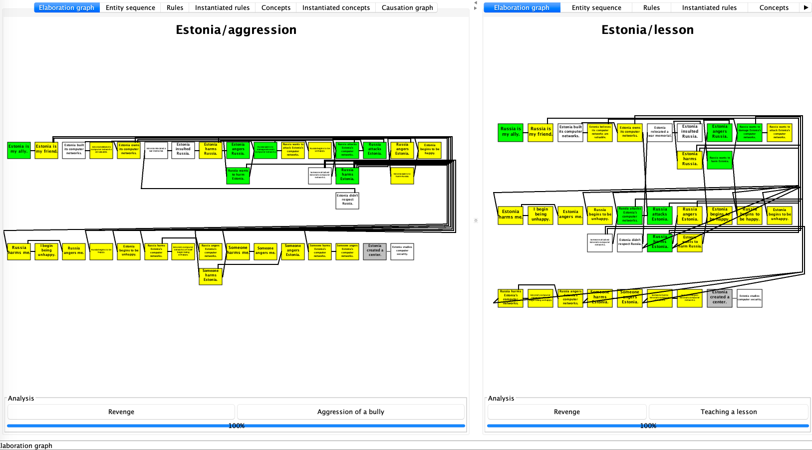
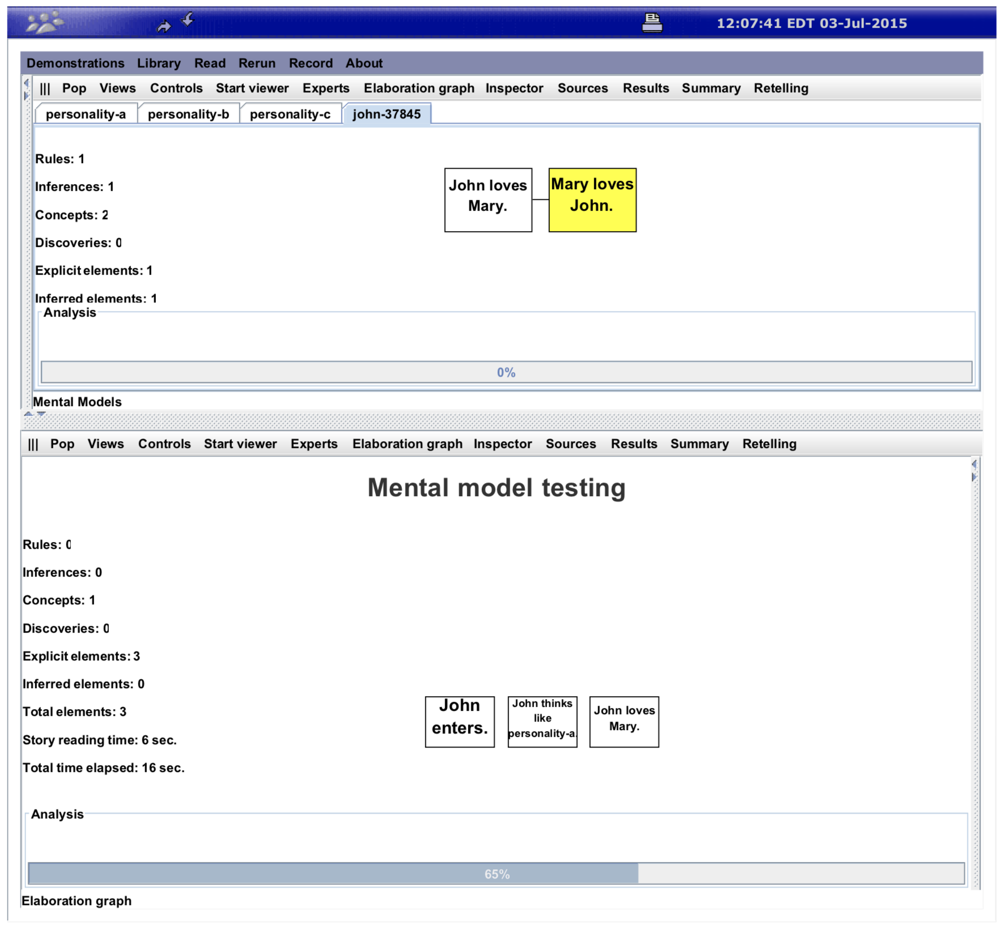
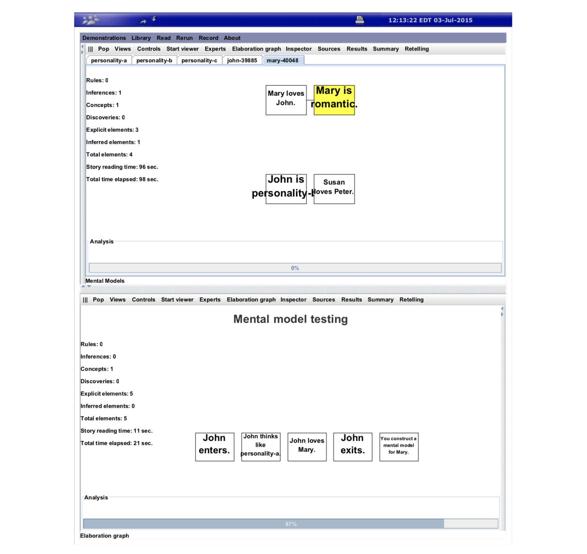
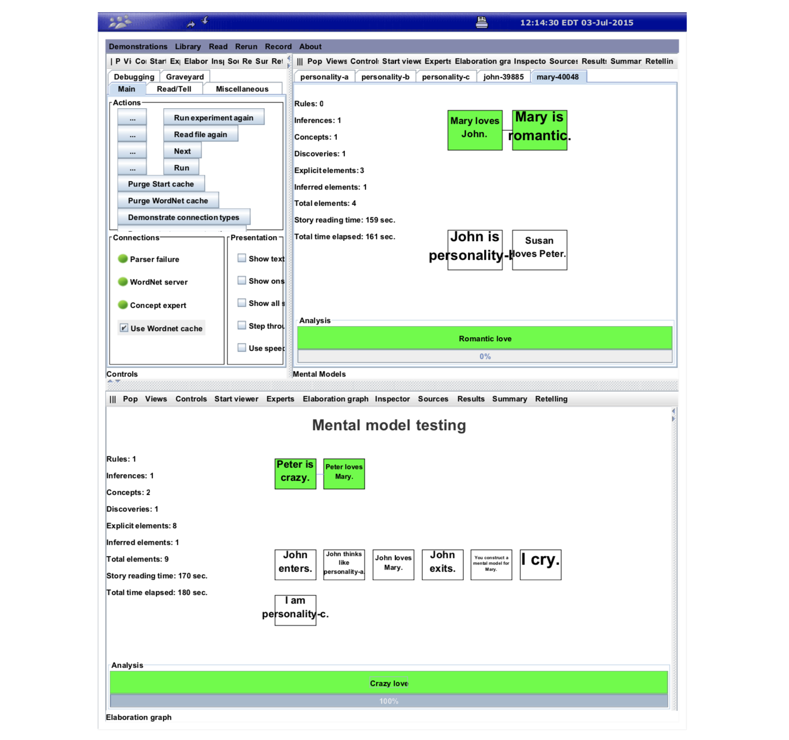

# Mental Models

A mental model is a representation of the surrounding world, the relationships between its various parts, and a person's intuitive perception about his or her own acts and their consequences.

Johnson-Laird (1983) thinks that human reasoning depends on mental models, instead of on logical forms. In this view, mental models can be constructed from perception, imagination, or the comprehension of discourse. See book _Mental Models: Towards a Cognitive Science of Language, Inference, and Consciousness_. See here for more reference [Wiki: Mental Models](https://en.wikipedia.org/wiki/Mental_model#References).

Mental models in Genesis serve several purposes:

* have the story read by readers with different sets of rules and concepts
    * Demo: [Allegiance differences in interpretation](#demo-allegiance-differences-in-interpretation)
    * Demo: [Culture Difference in Interpreting Macbeth](demo-macbeth2.md)
* model how different story actors view the events in the story
    * Demo: [Three Perceptions about Love](#demo-three-perceptions-about-love))
* augment the reader’s standard rules for particular story actors.
    * Corpora: See [Personalities](personalities.md) for a summary of existing personalities in Genesis corpus.
* enable different readers to see some but not necessarily all the story elements.
* enable the reader to have separate mental models of how an actor acts and how he thinks (because the actor may, for example, act viciously but view himself as kind)


---


# Demo: Allegiance differences in interpretation

In `corpora/stories/Cyberwar/Estonia2 common.txt`, We see the only difference between the two mental models is who is the ally.

```
Estonia and Russia are characters.
Estonia is a country.  Russia is a country.

First perspective.
Start story titled "Estonia/Aggression".
Estonia is my ally.

Second perspective.
Start story titled "Estonia/Lesson".
Russia is my ally.

Both Perspectives.
I am a person.

Show both perspectives.
Both perspectives.

Insert file Estonia plot.
```

That will trigger two different concept patterns defined in `corpora/stories/Cyberwar/Estonia reflective knowledge.txt`:

```
I am a person.
xx is an entity.
yy is a entity.

Start description of "Aggression of a bully".
xx is my ally.
xx's angering yy leads to yy's harming xx.
The end.

Start description of "Teaching a lesson".
yy is my ally.
xx's angering yy leads to yy's harming xx.
The end.
```

The resulting Elaboration graphs can be seen by running `Demonstrations > Allegiance differences in interpretation` in Genesis GUI:




---


# Demo: Three Perceptions about Love

Here, we will see an example of how to use mental models to model how one actor thinks, how another actor thinks he thinks, and how the reader thinks.

The file is `corpora/stories/MentalModel demos/Mental model sample.txt`. Note that you might need to run the file twice to see the personality-x files read by Geneis.

## ... Setting the stage

To introduce several idioms of general use, let's look at one example. It opens with standard lines that clear memory, establish GUI characteristics, and establish classifications for various entities:

```
Start experiment.
Set right panel to mental models.
xx, yy, and zz are persons.
John, Mary, and Peter are persons.
```

Next comes the lines that supply the rules and concepts to the mental model that determines how the reader thinks:

```
// Rules added to reader’s thinking mental model
Insert file General commonsense knowledge.

// Concepts added to reader’s thinking mental model
Insert file General reflective knowledge.
```

In the examples to follow, we will use the asserted rules. We will use a locally defined concept:

```
Start description of "Romantic love".
xx’s loving yy leads to xx’s being romantic.
The end.
```


## ... Identify the personality traits

Now, various personality traits are defined by idiom:

```
personality-a is a kind of personality trait.
personality-b is a kind of personality trait.
personality-c is a kind of personality trait.
```

Each such line creates a mental model using the file with a corresponding name, such as `personality-a.txt`, placed in `corpora/stories/Personalities/`.

Note that mental models have a boarder definition than personalities. The rules, concepts, and actions in a mental model can be typical of the personality, or the culture, or the gender, or the age.


## ... Define the personality traits

The mental model files may include typical rules and concepts, as in `personality-a.txt`:

```
xx and yy are persons.

// A rule associated with the personality type.
If xx loves yy then yy loves xx.

// A concept associated with the personality type.
Start description of "Reciprocated love".
xx’s loving yy leads to yy’s loving xx.
The end.

// A story optionally containing typical actions.
Start story titled "Personality A".
The end.
```
And the `personality-b.txt` file contains only a rule:

```
xx and yy are persons.
If xx loves yy then xx is romantic.

Start story titled "Personality B". The end.
```

The `personality-c.txt` file containt a typical action as well as a rule and a concept. Typical actions look like elements in a story. Evidently, people with this personality type are associated with crying and laughing.

```
xx and yy are persons.
If xx loves yy, then xx must be crazy.

Start description of "Crazy love".
yy is a person.
xx’s being crazy leads to xx’s loving yy.
The end.

Start story titled "Personality C".
x cries. x laughs.
The end.
```


## ... What does John thinks

Now back to the story. As usual, the story is started with a title-specifying idiom:

```
Start story titled "Mental model testing".
```

Next comes a line that does a lot of work.
- First, it creates a new thinking mental model that captures how John will read the story elements that John sees.
- Second, it transfers all the current rules and concepts in the reader’s thinking mental model to John’s thinking mental model.
- Third, it initiates the presentation of all story elements to John’s thinking mental model as well as to the thinking mental model of the reader.

```
John enters.
```

The mental model of the reader may not fully characterize how John thinks, so the next sentence idiomatically arranges for the rules and concepts in John to be augmented by rules and concepts from the personality-a mental model.

```
John thinks like personality-a.
```

Thus, John’s thinking mental model has a rule, `If xx loves yy then yy loves xx` from `personality-a` and two concepts, the original `Romantic love` from the reader’s thinking mental model and the new `Reciprocated love` from `personality-a`.

The next sentence goes into the reader’s mental model, where there is no rule associated with it, and also into John’s mental model, where it triggers the `If xx loves yy then yy loves xx` rule, which makes love always reciprocated.

```
John loves Mary.
```

The result is shown in figure below:



The next sentence idiomatically prevents John from seeing subsequent sentences in the story. There may be many `enters` and `exits`.

```
John exits.
```


## ... What does Mary think John thinks

The next sentence idiomatically creates a **thinking mental model** for Mary as if the sentence were Mary enters; however, sentences do not begin to flow into Mary’s thinking mental model.

```
Construct a mental model for Mary.
```

Now, because there is a thinking mental model for Mary, all sentences starting with `Mary believes...` flow into Mary’s thinking mental model, but not the reader’s mental model.

Thus, the embedded phrase `John is personality-b`, tells Mary’s thinking mental model to consider John to act in accordance with `personality-b`.

```
Mary believes John is personality-b.
```

That is, John’s acting mental model in Mary’s thinking model includes not only the rules and concepts generally available to Mary, but also those associated specifically with John’s acting model, which includes the rules and concepts from `personality-b`:

Now, if John is involved in a loving act, the loving person is considered romantic because John’s acting mental model in Mary’s thinking mental model includes a `personality-b` rule.

Accordingly, as shown in figure below. Mary’s thinking mental model has an acting mental model for John that supplies the romantic deduction.

Because the next sentence has John in a loving relationship, Mary becomes romantic in Mary’s mental model. Note, however, that there is no conclusion that John loves Mary because the governing rule is only in John’s thinking mental model, not in Mary’s and not in the readers.



Also, there is no conclusion that Susan is romantic because the sentence involving Susan does not involve John; hence, there is no use of rules in John’s acting mental model.

```
Mary believes Mary loves John.
Mary believes Susan loves Peter.
```


## ... What do you think

```
I cry.
```

Next, the reader cries, which suggests that the reader has type `personality-c`. Rules and concepts from that personality type now augment those previously used by the reader. Note that if the sentence were `Mary cries`, the augmentation would be limited to sentences involving Mary.


Now the `personality-c` abduction rule is activated by the following sentence, because the reader now has the rule `If xx loves yy, then xx must be crazy` from personality-c.

```
Peter loves Mary.
```

Finally, the story ends with `The end.`. Figure below shows the complete story analysis, with rules and concepts involved in acting mental models and thinking mental.



In summary, each mental model has a different concept. The reader sees `Crazy love`, made available to the reader via `personality-c`; John sees `Reciprocated love`, made available to John via the transfer from `personality-a`; Mary sees `Romantic love`, made available to Mary when Mary’s thinking mental model was created by transfer from the reader’s thinking mental model.


## ... Nuance

Note that the rules associated with an acting mental model are actuated whenever the corresponding actor appears anywhere in an entity because personality traits are not only about what someone tends to do (vicious) but also about what gets done to them (meek).

Accordingly, to be sure a rule works the way you want in the description of a personality trait, you may want to indicate which person has the trait, as in:

```
If xx is vicious and yy harms xx, then xx kills yy.
```

Otherwise, without the xx is vicious antecedent, if John is vicious and Paul is meek, then John harms Paul would cause Paul, the meek one, to kill John.


---

This version is edited by Zhutian Yang, on 10 August 2019

[An older version](https://groups.csail.mit.edu/genesis/Documentation/frames.pdf) is authored by Patrick H. Winston, in 3 July 2015
