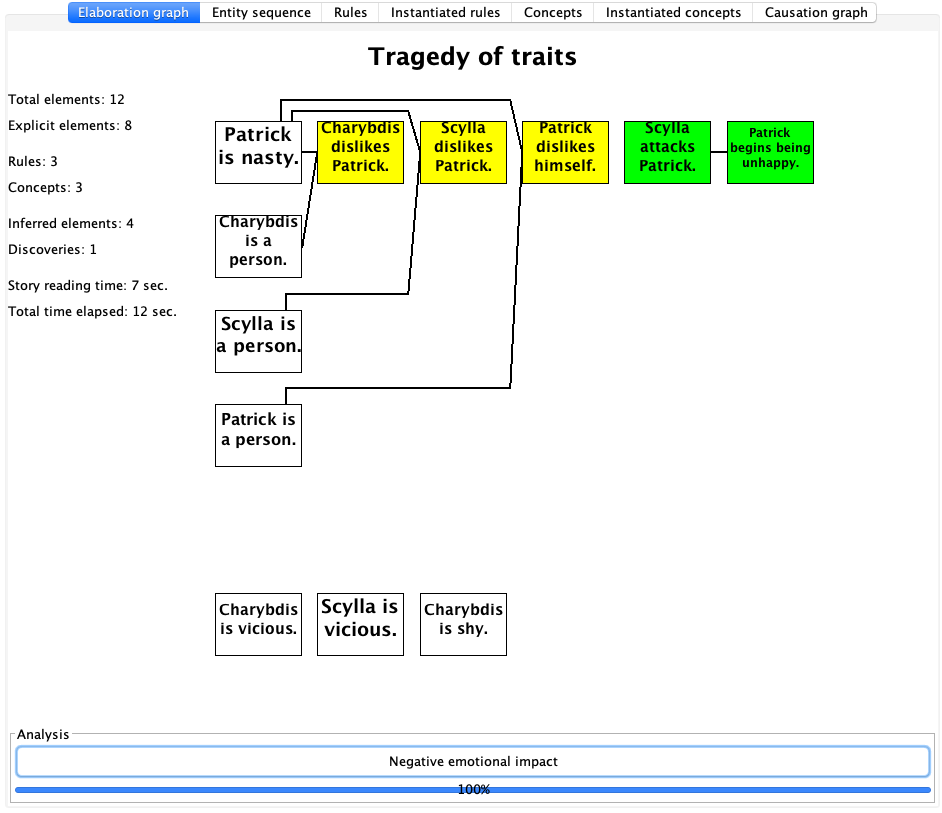
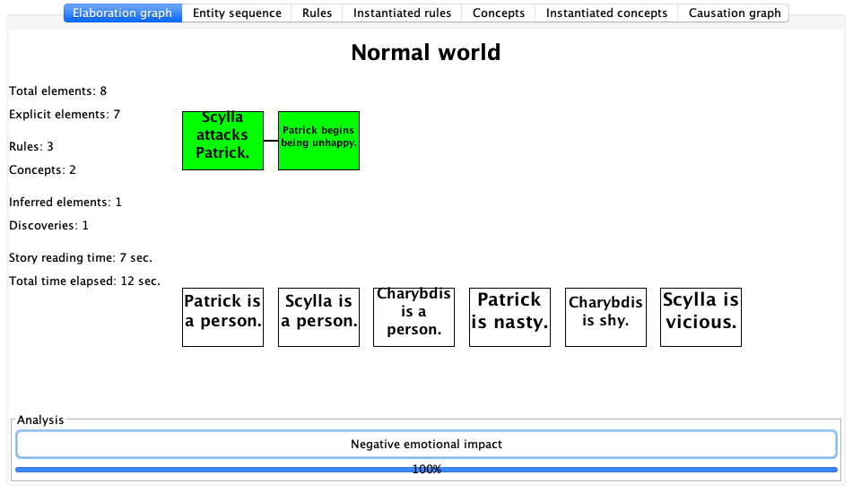

# Example Personalities

Here are the exiting personalities in Genesis Corpus: `corpora/stories/Personalities/`

* `I.txt` included the patterns for inspecting the thinking process of Genesis system
* cultural personalities
* personal personalities


## I

In this file, PHW was trying to construct concept patterns so that Genesis can recognize:
* when conclusions are made
* what it has found
* how did it solve a problem

So these are the important knowledge for demonstrating self-awareness, introspection, and explanation!!!

```
I am a person.
rr is a variable.
ss is a variable.
vv is a variable.
xx is a person.

Start description of "Reached conclusion".
xx concludes rr.
The end.

Start description of "Reached conclusion".
xx reached conclusion about rr.
The end.

Start description of "Failed to reach conclusion".
xx does not concludes rr.
The end.

Start description of "Failed to reach conclusion".
xx did not reach conclusion about rr.
The end.

//////////

Start description of "X believes Y".
xx believes rr.
The end.

ll is a variable.
mm is a variable.
oo is a variable.
vv is a variable.

If I think about vv, then I exist.

Start description of "Cogito, ergo sum".
xx's thinking about vv leads to xx's existing.
The end.

Start description of "Confirmation using belief".
xx's believing ll leads to xx's confirming mm.
The end.

Start description of "Problem solved using search".
the path's leading from ll to mm leads to xx's solving oo.
The end.

Start description of "Confirmation using search".
the path's leading from ll to mm leads to xx's confirming oo.
The end.

Start description of "Note danger".
I conclude that xx is lonely.
The end.

Start description of "Found means".
I succeed with "I find recipe for ll".
The end.

Start description of "Found steps".
I find recipe for ll.
The end.

Start description of "Found consequences".
I search forward from ll.
The end.

Start description of "Found causes".
// I explain ll.
My explaining ll leads to my solving yy.
The end.

// ------------------------------------------------------ Used in paper

// If xx thinks about ll, then xx be.

If xx believes ll then xx thinks about ll.

Start description of "Noted danger".
I found "xx is lonely".
The end.

/*
Start description of "Solved subproblem".
I solved rr.
I solved ss.
rr must not equal ss.
The end.
*/

// Start description of "Problem solved using belief".
// My succeeding with "I find vv in my beliefs" leads to my solving "did I believe vv".
// The end.

Start description of "Problem solved using belief".
My succeeding with "You establish that i believe vv" leads to my solving rr.
The end.

Start description of "Solved problem using search".
My succeeding with "You establish that a path leads from ll to mm" leads to my solving ss.
The end.
```


---


## Personality Demo

```
Both perspectives.

Show both perspectives.

xx is a person.
yy is a person.
aa is an action.

// If xx kills yy then xx harms yy.
If xx harms yy, then yy becomes unhappy.
If xx dislikes yy and xx avoids yy, then xx becomes happy.
If xx attacks yy, then yy becomes unhappy.

Start description of "Negative emotional impact".
xx's performing aa leads to yy's becoming unhappy.
The end.

Start description of "Positive emotional impact".
xx's performing aa leads to yy's becoming happy.
The end.

First perspective.
"Nasty" is a kind of personality trait.
"Shy" is a kind of personality trait.
"Vicious" is a kind of personality trait.
Start story titled "Tragedy of traits".

Second perspective.
Start story titled "Normal world".

Both perspectives.
Patrick is a person.
Scylla is a person.
Charybdis is a person.

Patrick is nasty.
Charybdis is shy.
Scylla is vicious.

Scylla attacks Patrick.
The end.
```

So here is what happened ... please be aware not to laugh too loudly.





## ... Nasty

```
xx is a person.
yy is a person.

If yy is nasty and xx is a person, then xx dislikes yy.
```


## ... Shy

```
xx is a person.
yy is a person.

If xx dislikes yy and xx is shy then xx avoids yy.
```

## ... Vicious

```
xx is a person.
yy is a person.
aa is an action.

// If xx dislikes yy and xx is vicious then xx wants to harm yy.
// If xx wants to harm yy and xx is vicious, then xx may attack yy.
xx may kill yy because xx is vicious and xx dislikes yy.
xx may kill yy because xx is vicious and yy angers xx.
xx may kill yy because xx wants to kill yy and xx is vicious.
// xx may kill yy because xx wants to harm yy and xx is vicious.

Start description of "Joy in enemy's suffering".
xx's disliking yy leads to yy's becoming unhappy.
The end.

Patrick is a person.
Boris is a person.

Start story titled "Vicious person's characteristics".
Patrick assaults Boris.
Patrick attacks Boris.
Patrick insults Boris.
Patrick kills Boris.
Patrick dislikes Boris.
The end.
```

---

## Other Common Personalities

Each one of them is short for testing.

## ... Ambitious

```
xx is a person.

// this is a typical concept pattern
Start description of "Leadership achieved".
xx is an entity.
xx's becoming ruler leads to xx's becoming happy.
The end.
```


## ... Corrupt

```
XX is a person.
YY is a person.

If XX is corrupt and YY is a person, then XX may harm YY.
```


## ... Crazy

```
xx is a person.

if xx becomes crazy, then xx may kill xx.
```


## ... Evil

```
ww, xx, yy, and zz are persons.

YY murders WW because YY wants to become king and because WW is the king and because YY is WW's successor.
```


## ... Greedy

```
xx is a person.
yy is a person.
zz is a person.
aa is an action.

if xx is greedy and xx is yy's wife, then xx may persuade yy to want to become king.

Start description of "Tragic greed".
xx is yy's relation.
zz is a person.
xx's being greedy leads to zz's harming yy.
The end.

Boris is a person.

Start story titled "Greedy person's characteristics".
Boris loves Money.
The end.
```


## ... Insane

```
Start commonsense knowledge. // we seemed no longer need this sentence six years ago

xx is a person.
yy is a person.

If xx is insane, then xx may kill xx.
If xx is insane, then xx may kill yy.
```


## ... Machiavellian

```
WW, XX, YY, and ZZ are persons.

Patrick is a person.
If XX is an enemy of ZZ and YY is an enemy of ZZ, then XX may be a friend of YY.
If XX is an enemy of ZZ and YY is an enemy of ZZ, then YY may be a friend of XX.

Start story titled "Machiavellian person's characteristics".
Patrick protects himself.
The end.
```

## ... Violent

```
xx is a person.
yy is a person.

If xx is violent, then xx may kill yy.
If xx becomes violent, then xx may kill yy.
```

## ... Wizard

```
WW, XX, YY, and ZZ are persons.

If xx angers yy, then yy may kill xx.

YY may murder WW because YY wants to become king and because WW is the king and because YY is WW's successor.
```

---

## Culture personalities

Here are the eastern, western, and asian personalities.

## ... Eastern

```
Insert file Eastern commonsense knowledge.

Start story titled "Eastern person's characteristics".
The end.
```

## ... Western

```
Insert file Western commonsense knowledge.

Start story titled "Western person's characteristics".
The end.
```


## ... Asian

This is used for the Lu murder story.

```
XX is a person.
YY is a person.
SS is an entity.
TT is an entity.

// Rules and concept pattern moved in from Eastern Commonsense1

// corrupt society
If SS is individualistic then SS is corrupt.
If XX studies in SS and SS is corrupt, then XX becomes corrupt.

// violence glorifying society.
If SS's media glorifies violence, then SS glorifies violence.
If XX comes from TT and XX studies in SS and SS glorifies violence, then XX becomes vicious.
If XX feels frustrated, then XX becomes angry.
If XX becomes vicious and XX becomes angry, then XX becomes murderous.

// murderer personality.
If XX becomes corrupt and XX becomes angry and XX feels frustrated then XX becomes murderous.
If XX becomes corrupt and XX feels dishonored then XX becomes murderous.
If XX becomes corrupt and XX feels victimized then XX becomes murderous.
// If XX becomes violent and XX becomes angry and XX feels dishonored then XX becomes murderous.
If XX becomes corrupt and XX becomes violent and XX feels dishonored then XX becomes murderous.

// suicidal personality
If XX is lonely and XX feels frustrated then XX becomes suicidal.
If xx becomes suicidal then xx may kill xx.

Start description of "Murderous influence".
ss's being individualistic leads to xx's killing yy.
The end.

Start description of "Murderous influence".
ss's glorifying violence leads to xx's killing yy.
The end.

America is a country.

// A story optionally containing typical actions of an Asian person
Start story titled "Asian person's actions".
I believe America is individualistic.
I believe America glorifies violence.
I believe America's media glorifies violence.
I believe America is rich.
The end.
```
---


## Four year old

Caroline onoff wrote these files in 2018

```
VV is a thing.
WW is a person.
XX is a person.
YY is a physical-thing.
ZZ is a psych-thing.
AA is a physical-thing.
BB is a psych-thing.

//   UNCOMMENT BELOW
//If WW contacts VV and WW has a physical-sickness, then WW may have a physical-sickness because WW runs in VV.

//If WW contacts VV and WW becomes sick, then WW may become sick because WW runs in VV.
//If WW runs in VV and WW becomes sick, then XX believes WW becomes sick because WW runs in VV.

//If WW contacts VV, then WW may have physical-sickness.
//   EXPAND THIS FUNCTIONALITY If XX contacts VV, then XX may have itchy spots.
//WW's contacting VV leads to WW's having itchy spots. //becoming sick.

//If WW eats VV, then WW may have physical-sickness.
If WW has a negative-psych-action, then WW may have physical-sickness.
//WW may have physical-sickness because WW has negative-psych-action.
//WW may have physical-sickness because WW thinks about VV. // and WW has a negative-psych-action.
//WW may have physical-sickness because WW has a negative-psych-action because WW thinks about VV.

Start story titled "Four-year-old's characteristics".

The end.
```
