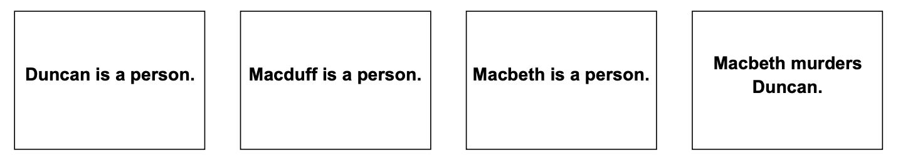

# How to write stories

Each story to be processed by Genesis is written in one or more text files.

## Basic idioms

Here is a simple story in `corpora/samples/genesese.txt`:

```
Start experiment.

Start story titled "Tragedy of Macbeth".

Macbeth, Macduff, and Duncan are persons.

Macbeth murders duncan.

The end.
```

The result appears in the elaboration graph shown in figure below:




The line `Start experiment.` is an idiom that tells Genesis to clear text boxes and memories from previous experiment out of story processors in preparation for reading a new story.

The line `Start story titled "Tragedy of Macbeth".` is an idiom that tells Genesis that a story is about to be told and the name of the story.

The line `The end.` is an idiom that tells Genesis that the story is concluded.

To read such a file, you click on the Read button on the Genesis interface and navigate to your file, as shown in figure below:


## File reader idiom

Naturally, you will want to assemble experiments using multiple files, perhaps one for common sense rules, another for concept patterns, yet another for the story. This is easy to arrange using the file

reader idiom, as in the following examples. Note that.txtis assumed by the idiom processor:

```
// Find and read file named "General commonsense knowledge.txt"
Insert file General commonsense knowledge.

// Find and read file named "General commonsense knowledge.txt"
Insert file General reflective knowledge.
```

But where are those files? Genesis does you a favor and looks around locally in your file structure to find them. If there are multiple files with the same name, you need to be careful, of course.

Genesis will warn you that there are such name conflicts on the console, and pick one file from the alternatives, but you won’t know if you ignore the console.


## Switch idioms

Genesis has lots of switches, many of which can be set by idiom. At this writing, all the switches in the Subsystems panel, the Story summarizing panel, the Story persuasion panel, the Why questions panel, and the Presentation panel can be set by idiom, as suggested by the following examples.

```
Set Show markup switch to true.
Set Summarizer switch to false.
```

See [Switches](genesis-switches.md) for a list of existing switches.


## Text entry box idioms

Another general purpose idiom primes the text entry box. For example, the following primes the text entry box with `Make Macbeth be nice`:

`Insert into text box: Make Macbeth be nice.`

You can put this anywhere in a file.


## Perspective idioms

Genesis has two primary story processors, and various idioms tell Genesis where to direct the text and what to show on the user interface.

```
Both perspectives. // Direct text to both story processors.
First perspective. // Direct text to left-side story processor only.
Second perspective. // Direct text to right-side story processor only.

Show both perspectives. // Show both perspectives.
Show first perspective. // Show left-side elaboration graph only.
Show second perspective. // Show right-side elaboration graph only.
```

See [Demo](demo-macbeth2.md) for how different culture perspectives can be used in interpreting Macbeth.


## User interface idioms.

The genesis user interface has three panes. The panel to display can be indicated under idiom control. For example:

```
Set left panel to controls.
Set right panel to mental models.
Set bottom panel to elaboration graph.
```

All the possibilities are exposed when you click on the three vertical bars on the top left of each pane.

See [Panes](genesis-panes.md) for a list of existing panes.


## Deprecated idioms

You may see in files various idioms that were once useful, but now are ignored or replaced. For example:

`Insert file Start experiment`

The story processors used to be initialized by reading idioms from a file. Now, this idiom merely does the same thing as `Start experiment` which involves no file reading.

`Start commonsense knowledge.`

This idiom used to tell the user interface that the next lines of text were part of the common sense collection. This is now automatic and the idiom is ignored.

`Start reflective knowledge.`

This idiom used to tell the user interface that the next lines of text were part of the concept pattern collection. This is now automatic and the idiom is ignored.


## Comments

Naturally, you will want to comment your work, just as you would for your code. You use the Java conventions, with a double slash, //, introducing a single line comment, and matched /* and */ pairs bracketing multiline comments:

```
// The idiom for resetting story processor memory:
Start experiment.

/*
A sample story, starting with an instance of the "Start story titled..."
idiom and ending with an instance of the "The end." idiom.
*/

Start story titled "Tragedy of Macbeth".
Macbeth, Macduff, and Duncan are persons.
Macduff murders Duncan.
The end.
```

At the moment, you cannot nest /* and */ pairs.


## Scenes

Ordinarily, if you write `Boris insults Patrick` in a story twice, it only shows up once because it is assumed to be the same insult.

You can have it appear twice, however, by starting a sentence with “Then, ...”, which puts in a scene marker and allows the same innerese expression to appear more than once, as in this story, with the result shown in figure below.

```
Start story titled "Duplicates".
Boris insults Patrick.
Boris insults Patrick again.
Then, Boris insults Patrick yet again.
The end.
```

The second insult is not recorded in the story, but the third one is, because it is in a new scene.


---

This version is edited by Zhutian Yang, on 6 August 2019

An older version of [How to speak Genesese](https://groups.csail.mit.edu/genesis/Documentation/Genesese.pdf) is authored by Patrick H. Winston, on June 8, 2018
