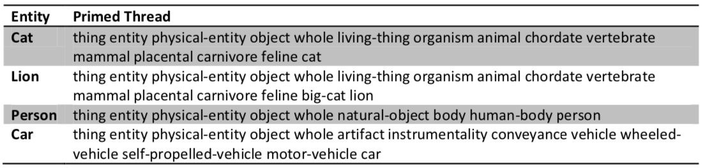
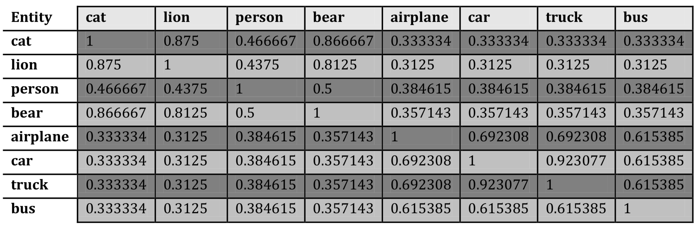
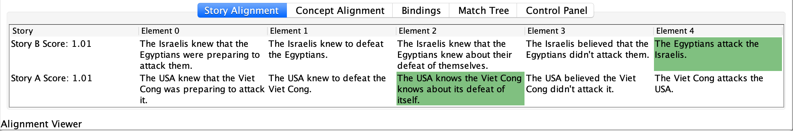
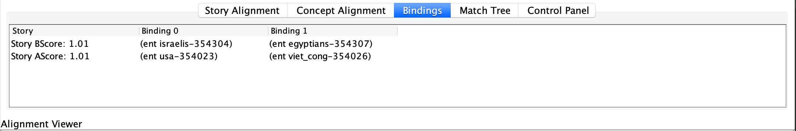

# Imagination through Story Alignment

The ideas and demos come from Matthew Paul Fay's 2012 MEng thesis [Enabling Imagination through Story Alignment](http://groups.csail.mit.edu/genesis/papers/Fay%202012.pdf).

## Story comparison

People intuitively use story comparison to draw on old experiences to construct and understand new ideas. Matthew's algorithms are capable of providing a polynomial time solution to an otherwise exponential time problem.

A story is a sequence of time ordered story elements. The inputs to the algorithm are two sequences, A and B, and a similarity matrix, S, comparing all element types that exist in the domain. The goal is to find an alignment between sequences with a maximal alignment score where the score is calculated by summing over the similarity of each pair of elements in the alignment. Gaps are allowed anywhere in the alignment and are given a constant gap penalty d.

## Sequence alignment by NW algorithm

Steps to determine the matching sequences using the Needleman Wunsch algorithm:

1. Calculate the scoring table
2. Trace the maximum matching threads
3. Write down the matching sequences

### Step 1: Calculate the scoring table

For example, here are the rules for scoring:

* If match, score + 1
* If mismatch, score - 1
* If Small insertions and deletions (INDELs), score - 1

Eg. sequences:

1. ATCGGAG
2. ATGGCAA

Scoring matrix: F (i,j) = max{

* F(i-1, j-1) + S(i,j)  ==>  F(↖) + S(mtach/mismatch)
* F(i-1, j) + S(indel)  ==>  F(↑) + S(indel)
* F(i, j-1) + S(indel)  ==>  F(←) + S(indel)

}

The resulting scoring matrix:

|  |   |  A |  T |  C |  G |  G |  A |  G |
|--|---|---|---|---|---|---|---|--|
|  |  0 |  -1 |  -2 |  -3 |  -4 |  -5 |  -6 |  -7 |
| A  |  -1 |  1 |  0 |  -1 |  -2 |  -3 |  -4 |  -5 |
| T  |  -2 |  0 |  2 |  1 |  0 |  -1 |  -2 |  -3 |
| G  |  -3 |  -1 | 1  | 1  |  2 |  1 |  0 |  -1 |
| G  |  -4 |  -2 | 0  |  0 |  2 |  3 |  2 |  1 |
| C  |  -5 |  -3 | -1  |  1 |  1 |  2 |  2 |  1 |
| A  |  -6 |  -4 | -2  |  0 |  0 |  1 |  3 |  2 |
| A  |  -7 |  -5 | -3  |  -1 |  -1 |  0 |  2 |  2 |

### Step 2: Trace the maximum matching threads

|  |   |  A |  T |  C |  G |  G |  A |  G |
|--|---|---|---|---|---|---|---|--|
|    |  0 |   |   |   |   |   |   |   |
| A  |   |  1 |   |   |   |   |   |   |
| T  |   |   |  2 |  1 |   |   |   |   |
| G  |   |   |   |  1 |  2 |   |   |   |
| G  |   |   |   |   |   |  3 |   |   |
| C  |   |   |   |   |   |  2 |   |   |
| A  |   |   |   |   |   |   | 3  |   |
| A  |   |   |   |   |   |   |   | 2  |

### Step 3: Write down the matching sequences

If the line goes horizontally at row N, add a dash after N; if the line goes vertical at column M, add a dash after M.

There are two matching threads. If we choose the 1 on the right of 2 (TT):

* ATCGG-AG
* AT-GGCAA

If we choose the 1 on the left of 2 (GG):

* ATCGG-AG
* ATG-GCAA

Among these two, the best match is:

* ATCGG-AG
* AT-GGCAA

## Word Alignment by WordNet

Using WordNet thread, similarity between two entities is calculated by counting the number of matched elements in the entities’ primed threads and dividing the result by the maximum length of the entities’ threads.

Example similarity scores:

## Demo: Predict Future of Conflicts

One useful application for story alignment in this domain is to align partial stories of conflicts to see what future events can be predicted from historical occurrences.

One way is to match story elements:

Another way is to match concepts:

A relation represents any sort of interaction between the things.

An elaboration graph is a visual representation of how all the events in the story are connected to each other and the inferred events from common sense knowledge.
