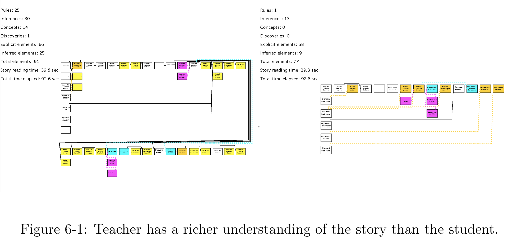
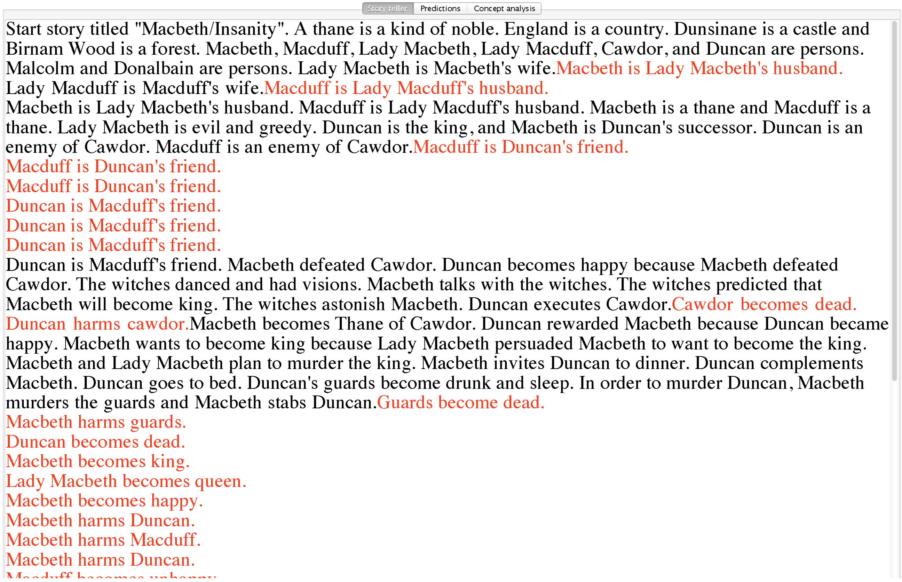
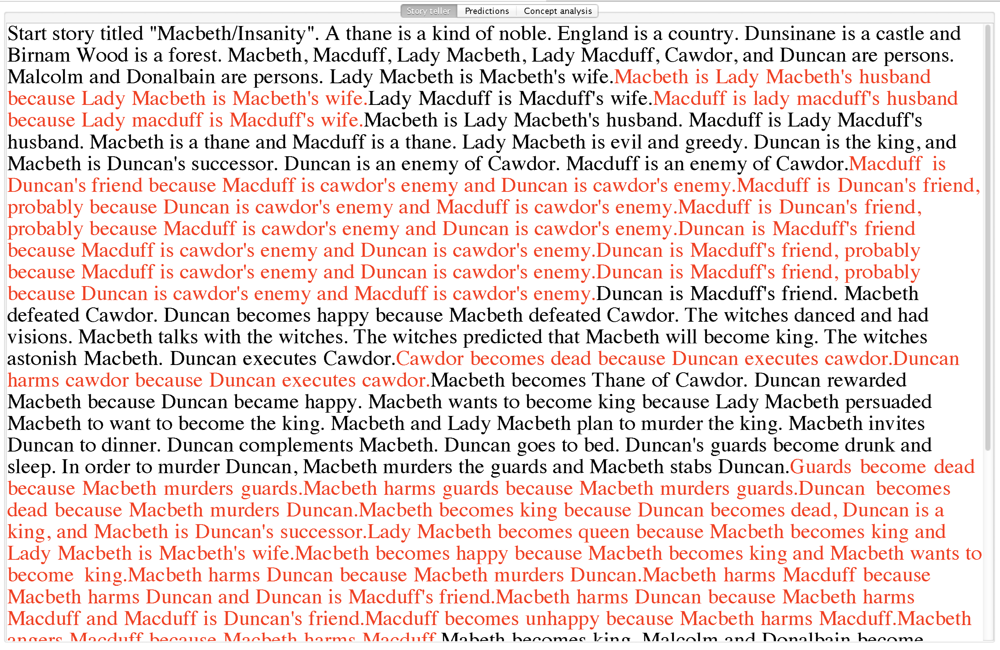
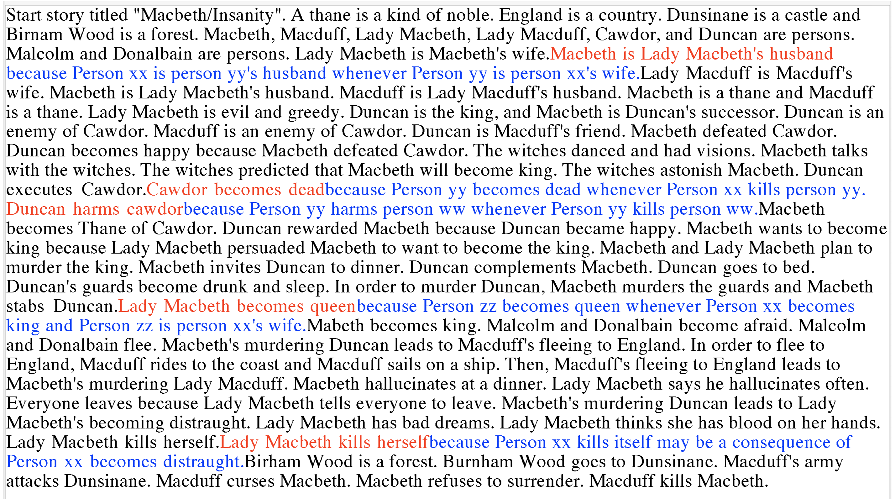
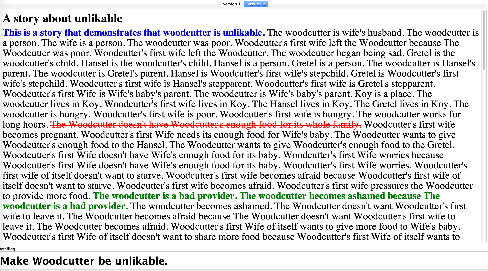
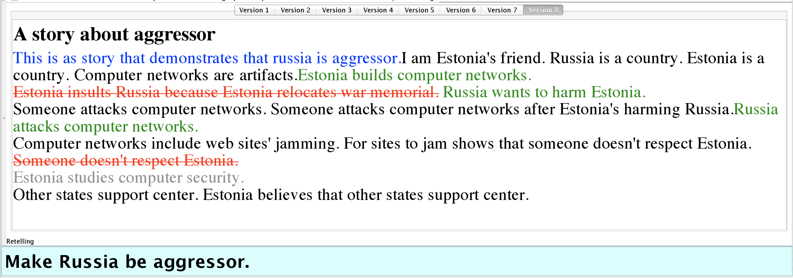

# Story Reteller

Here we will see the ideas and demonstrations from Sayan's MEng Thesis: [Audience Aware Computational Discourse Generation for Instruction and Persuasion](http://groups.csail.mit.edu/genesis/papers/Sayan%202014.pdf), 2014 <mark> and my thought.

## Intro: Audience Aware Storytelling

Sayan sees storytelling as a goal directed social activity. The main problem is to automatically generate discourse to serve instructive and persuasion goals. <mark> The next step is to change from teacher to student relationship to character 1 to character 2 relationship, both of which have incomplete knowledge and mental model of each other

* Human storytelling competence and possible computational applications:
    1. **Build Mental Models of Others**. Given information about the audience (e.g., demographic, favorite books), the system **models the knowledge and beliefs they might hold**.
    2. **Update Mental Models of Others**. Given feedback about how the mental models are incomplete or incorrect, the system update the models.
    3. **Achieve Narrative Goals**. **Specify the goals as certain reactions the storyteller wants to elicit from the audience**.
    4. **Mental Simulation of Social Interactions**. Simulate telling a story to its perceived audience and thus predict the audience's reactions.


### 1 & 2. Maintain mental models of audience

* **Modeling the audience** in terms of its
    * knowledge and beliefs about the world
    * personal stimulus-action
    * emotional state
    * bank of previous stories and personal memories

* The audience has **concept patterns**, including:
    * personality traits such as “nice”, “generous”, and “selfish”
    * situational attributes such as “in a dilemma”, “unlucky”, and “in survival mode”
    * social roles with value attached to it such as “bad parent” and “good husband”

* Other patterns: **Novelty and interestingness checks** carried out by comparing the newly generated story to the bank of previous stories

<font color="#f1c40f"> ways to verify if an actor or an event is of certain attributes:

    * compare with other stories: novel or banal: interesting or boring; surprising or normal
    * thinking pattern detection: funny,
    * behavior pattern detection: brave,

</font>


### 3 & 4. Elicit reactions

* Example of **Stimulus-Action** Matrix Portion:
    * Stimulus: Bully encounters a usual victim of his abuse.
    * Possible next actions: [Apply physical force (0), Engage in verbal abuse (0), Do nothing (0.7), Apologize (0.2), Act friendly(0.1)]

<font color="#f1c40f">
I don't think humans make decisions based on probability. There is always context and we try to make the most optimal decision. Thus it is unlikely that a matrix can account for all the possibilities and probabilities.
</font>


* The storyteller's tools to craft **narrative discourse**:
    * Priming the audience using paratext
    * Using motifs and repetition for emphasis
    * Invoking the "post hoc ergo propter hoc" fallacy, or deliberately avoiding it
    * Evoke empathy within the reader, or knowingly avoiding it
    * Fine tuning the coherence of the discourse for desired effect on persuasiveness
    * Making references to the audience's base of prior stories, and to familiar masterplots
    * Using analogies and metaphors
    * Using humor to soften the audience's cognitive resistance to opinion changes


* Narrative tools for **persuasive discourse generation**
    * Selection narration: Select the information that serve the persuasive goal we set out to achieve
    * Variable focalization: Skew the opinions of the reader to a conclusion favored by the narrator. Achieve this by representing the same events from the different perspectives. <mark> Suri's work on detecting the goals of the storyteller
    * Variable speed: Narrating an event with more details makes the reader perceive it as more important. Achieve this by representing events as consists of sub-events so that a given event can be expanded or collapsed. <mark> Use "concept pattern" as a way to do abstraction
    * References to the reader's prior story base and use of master plot: People are quicker to be persuaded by stories which bear resemblance to the other stories they already know. <mark> If we use the example of something the person just understood, learned, or saw, he may find it easier to accept it.
    * Evoke sympathy/empathy from the reader: Eliciting an emotional response from the reader can be a powerful path to persuasion. Model the personality traits of the readers.
    * Manipulate "Post hoc ergo propter hoc" fallacy: The reader's notions of causality in the story can be manipulated by appealing to this fallacy.
    * Continuity/Coherence for persuasion: Stories that appear to be continuous and coherent are more persuasive. Improve the continuity and coherence of the story by first defining good metrics.
    * Repetition


### n. Leaning and more

* The storyteller **learn from feedback**:
    * how her model of the audience was incomplete or incorrect.
    * heuristics for what tools to use to achieve which goals,
    * techniques that are best used together.


---

## Instructive Narrative Generation

The two Genesis perspectives describe the understanding of the teacher and the understanding of the student.



There as four teaching modes depending on the granularity of instruction, specified as four options in GUI > Subsystems > Story Teller:

* Tell - Show the elaboration graph of the student with its own mental model

* Spoon feed - The teacher relays the **missing element** to the student via the student’s _Story Element Input Port_.



* Explain - The teacher relays the missing element, as well as the **story element which is a cause of the missing story element** as seen on the teacher's elaboration graph to the student via the student’s _Story Element Input Port_.



* Teach (principles) - The teacher relays the missing story element on the student’s _Story Element Input Port_, and relays **the general rule that will enable the missing story element to be included in the student's elaboration graph** on the student’s _Rule Input Port_.



Color codes:

* <font color="#e74c3c">Colored red</font>: statements in the discourse provided in addition to the explicit text of the story
* <font color="#3498db">Colored blue</font>: principles provided by the teacher to the student in the discourse, which are immediately incorporated into the student’s knowledge base and can be used in making inferences for the rest of the narration period

An elaboration graph is produced that demonstrates the teacher’s understanding of the story.


---


## Persuasive Narrative Generation

The two Genesis perspectives describe the same audience’s reaction to being told the same story in two different ways.

The end user may instruct the storyteller to generate different narrative discourses around Hansel and Gretel such that The Witch appears to be a likable character, or that The Woodcutter is not forgiven for his parenting crimes and appears to be an unlikable character.

The end user may specify:

* the story: to process for persuasive retelling
* the commonsense: mental model of the audience, including the rules, concepts, and super concepts
    * one end user may choose to define “Likable” as a super concept consisting of “honest”, “hardworking” and “generous”, while another end user may choose to define “Likable” as consisting of “humorous”, “misunderstood” and “friendly”
* the goal (from Text Entry Box): the statement to persuade the audience by the end of the narrative
* the retelling options:
    * whether to use subtractive methods and additive methods in the generation
    * Whether to take a single-character or relativistic approach to the discourse
generation


### Algorithm

**1. Find Problems** - The story is processed by the audience's mental model and the concept patterns are identified. Then the concept patterns identified are checked against the requirements of the persuasion goal, specified in format, _Make CHARACTER-X be CONCEPT_.


**2A. Remove Elements** - Any concept patterns identified that would hinder the achievement of the given persuasion goal are considered “undesirable” and are marked to be removed. How a concept pattern comes to be considered “undesirable” depends on the whether the program is operating in “single-character” or “relativistic” mode. Take the example where the persuasion goal is described as “Make The Witch be likable.”:

* If single-character mode: Among the concepts involving The Witch that emerge from the analysis of the raw story, **any concept that would negate the perception** that The Witch is likable would be marked as undesirable. For example, a “cruel” concept triggered by The Witch trying to cook Hansel and Gretel in the oven might be marked for elimination.

* If relativistic mode: In addition to the concepts identified as undesirable by the standards of the single-character mode, in the relativistic mode, **any concepts that make other characters appear likable** might also be marked for elimination. This is because when The Witch is surrounded by unlikable characters in the narrative, for example, it would become easier to persuade the audience that The Witch herself is likable.


**2B. Add Elements** - Any concept patterns identified that would support the achievement of the given persuasion goal are explicitly considered “desirable” and are marked to be retained. Again, how a concept pattern comes to be considered “desirable” depends on the whether the program is operating in “single-character” or “relativistic” mode.


**3. Check Success** - The persuasive discourse generated is considered successful if the audience, upon analyzing the discourse identifies only those concept patterns that agree with or don’t affect the persuasion goal, and identifies none of those concept patterns which would disagree with, or work to negate the perception of the character aimed for in the persuasion goal.

## Demo: Likable or Unlikable



The text of the generated discourse shows the differences between the raw form of the story and the generated discourse:

* <font color="#e74c3c" style="text-decoration: line-through;">Colored red and struck-through</font>: Statements in the discourse that are purposefully taken out are the story
* <font color="#1abc9c">Colored green</font>: Statements in the discourse that are purposefully retained
* <font color="#3498db">Colored blue</font>: Statements that are added like a preamble

## Demo: Russian or Estonia

Discourse shaped to make Russia or Estonia appear as the aggressor in the conflict.




---

<font color="#f1c40f">
## Problems with Concept Patterns

The concept patterns used in the story teller to detect concepts are too laborious to craft. There must be simpler ways.

Here are example concept definitions of Bad parent:

```
Start description of "Bad parent".
XX is a person. YY is a person.
XX is YY’s parent. XX abandons YY.
Evidently, XX triggers "bad parent".
The end.

Start description of "Bad parent 2".
XX is a person. YY is a person.
XX is YY’s parent. AA is an action.
XX’s performing AA leads to YY’s becoming afraid.
Evidently, XX triggers "badparent 2".
The end.

Start description of "Bad parent 3".
XX is a person. YY is a person.
XX is YY’s parent. YY becomes angry with XX.
Evidently, XX triggers "badparent 3".
The end.
```

So abandon, frighten, and anger are all behaviors of a bad parent. Can these concept pattern rules be used to form the personality profile of a bad parent? Can these rules be used to solve problems such as "keep the kids of neighbors away from my yard"?

What if XX died and left his kids afraid, is XX is bad parent? What if XX is busy and never attend to his kids, is XX is bad parent? Can we answer all these questions by reasoning as opposed to retrieving? Maybe fundamental moral knowledge needs to be encoded about what is good and bad, what is right and wrong, then all the other reasonings are based on those values.

Maybe those connections are all associations. So "XX makes YY afraid" and "XX abandons YY" both lead to "XX is seen as bad parent to YY."

</font>
