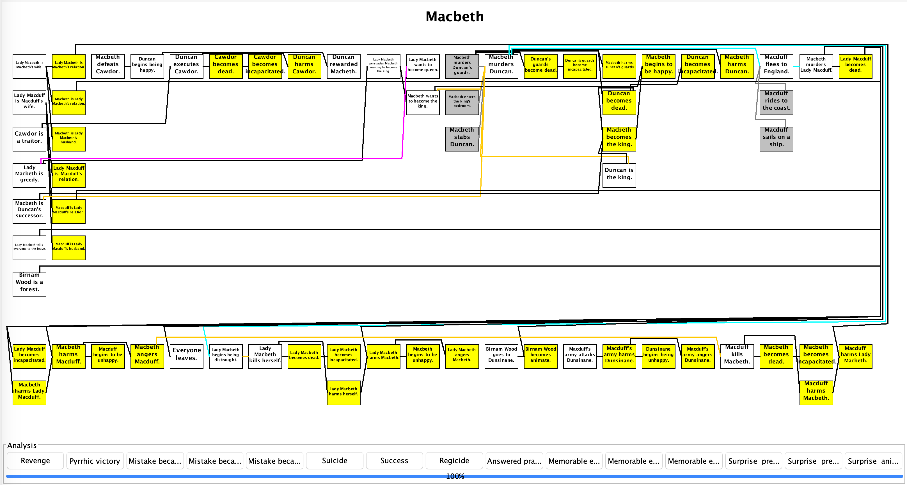
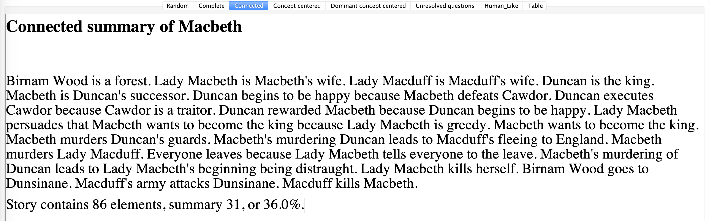
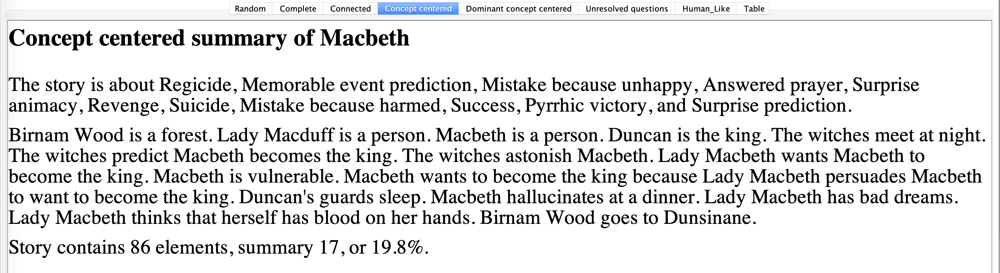
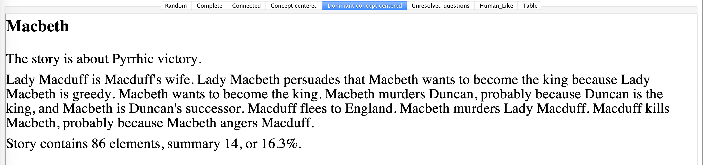
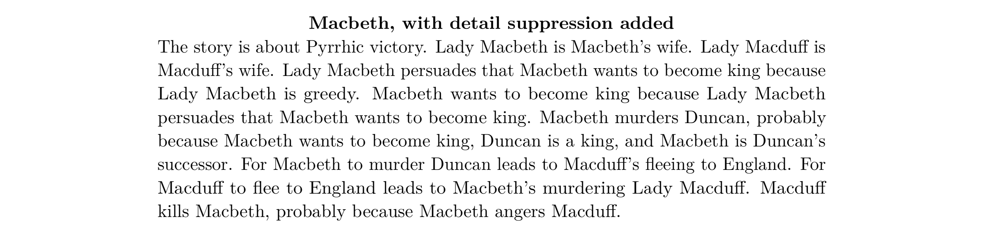

# Story Summarizer

Here summarizes the ideas and demos in Winston's [Model-based Story Summary](https://dspace.mit.edu/bitstream/handle/1721.1/99102/SummaryCMN15.pdf?sequence=1&isAllowed=y) in 6th International Workshop on Computational Models of Narrative (May 2015).

To build a story summarizer, Winston thinks it useful to retell only the sentences that are involved in concepts of interests, while eliminating disconnected story elements and obvious inferences.


## Demo: Macbeth Plot




### Principles of Connectivity

Keep only those explicit elements that are causal connections and explicit elements that are embedded in Genesis’s inferred causal connections.




### Principles of Concept Focus

Include only explicit elements that lead eventually—via a chain of inferred connections—to an element lying in an instantiated concept pattern.




### Principle of Dominant Concept Focus

Pyrrhic victory dominates all other concepts in the sense that it incorporates the most story elements.



### Compression by eliminating details of how actions are performed

Suppresses details about the guards, the bedroom, and stabbing.



### Compression using the post hoc ergo propter hoc assumption


After this does not mean because of this in logic, but we use it nevertheless in telling stories smoothly, dropping explicit cause when proximity makes the cause apparent:


## Implementation

```
Popup Macbeth summary popup.

Set all switches to defaults.

Set Include unabridged version switch to true.

Set Include agent roles switch to false.

Set Always include surprises switch to false.

Set Include explanations switch to true.

Set Filter out means switch to true.

Set Filter out if follows from switch to true.

Set Show markup switch to true.

Insert file Macbeth1 summary.
```
