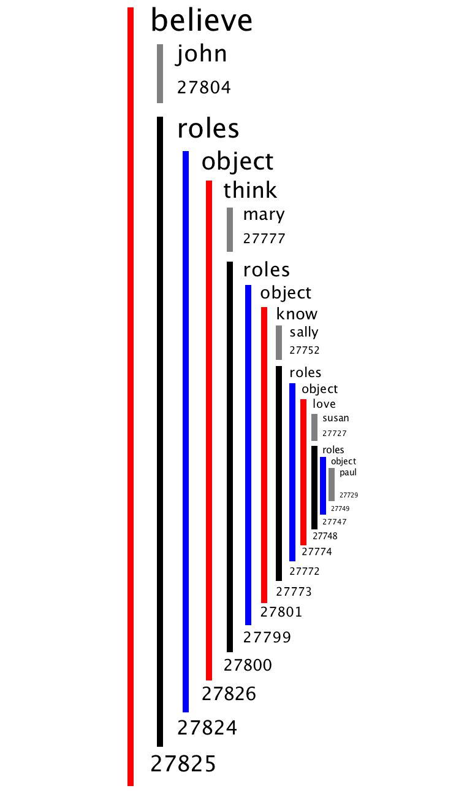

# How to speak Genesese

_Genesese_ is the subset of English understood by Genesis. _Understood_ means that the English is parsable by Boris Katz’s START parser to produce a set of linguistic triples, which Genesis Translator uses to form into Genesis’s inner language, _Innerese_. All story element and knowledge in Genesis is produced via Genesese-to-Innerese parsing and translation.

Genesese is also the subset of English generated by Genesis. _Generate_ dmeans that the Innerese is translated into the linguistic triples needed by START’s generator to produces English sentences.

## START triples

The linguistic triples produced by START parser form a semantic net.

## "Become"

Early in the development of Genesis, a conundrum appeared. If you say `Macbeth is happy`, does that mean Macbeth has been happy since the beginning of time or that he has just become happy? We humans sort it out with a level of common sense not yet in Genesis.

The solution is to say `become` explicitly when a property just appears.

## Quotation

Sometimes START needs a little help when sentences get deeply nested. You can do this using nested `""` and `<>` pairs as in the following example:

`John believes "Mary thinks<Sally knows "Susan loves Paul">".`

We use the brackets instead of matched single quotes because the use of single quotes for possession would confuse Genesis terribly. The result of the demonstration sentences is as in figure below.

Geneses also provides a bit of syntactic sugar.

`John: Mary is crazy.`

is equivalent to

`John says "Mary is crazy".`

---

This version is edited by Zhutian Yang, on 6 August 2019

An older version of [How to speak Genesese](https://groups.csail.mit.edu/genesis/Documentation/Genesese.pdf) is authored by Patrick H. Winston, on June 8, 2018
